# [Learn Data Science Tutorial - Full Course for Beginners](https://www.youtube.com/watch?v=ua-CiDNNj30&list=PLWKjhJtqVAblQe2CCWqV4Zy3LY01Z8aF1&index=1&t=1416s)

From Barton Poulson

# Introduction to data science

People usually see data as a too techy discipline with maths and labs but it is much more a creative discipline: you use tools from coding, stats & maths to work creatively with data in order to find a way to solve problems, and get insights from data. For that, you try to listen to almost all your data as **everything signifies**.

This course gives a map of data science and how we can use it.

## Definition of data science
It is coding, maths & statistics in applied settings or the analysis of diverse data or inclusive analysis. 

### The data science Venn diagram
According to Drew Conway, data science is a combination of coding (computer programming, hacking), stats & maths (quantitative abilities) and domain expertise (intimate familiarity with a particular fields).
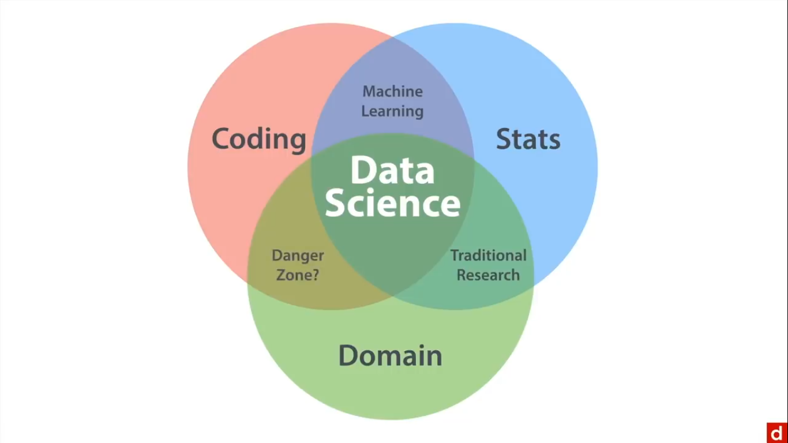

- Coding: 
It helps gather and prepare data coming from different sources. Note that it can require real creativity. There is statistical coding (R & Python), database manipulation (SQL), the command line interface (bash), and also search (regex: regular expression).

- Math:
Probability, algebra, regression, etc. helps to choose the procedures to manage data and diagnose problems encountered when manipulating them.

- Domain Expertise:
goals, methods used, and constraints of the field in order to implement them well.

Note that the combination of these three can lead to other inner-circles: ML, Traditional research and the danger zone.
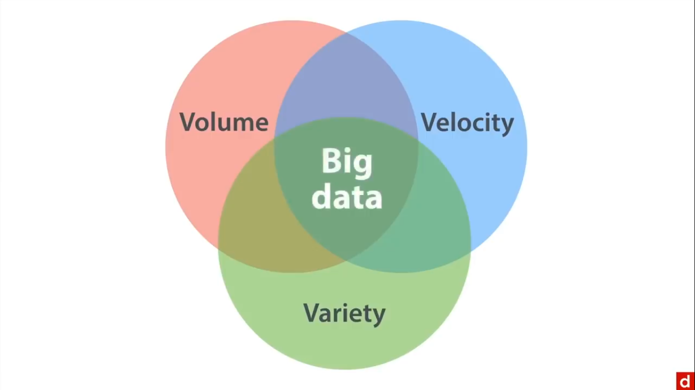

- ML: coding and math without any domain expertise. It doesn't involve applications.
- Traditional research: math or stats and domain knowledge without programming. The data here is already structured and ready for analysis. We just need to choose method and interpret results.
- Danger zone: coding & domain knowledge without maths can be used for drawing maps and counting words.


### The data science pathway
The steps are the following :
- planning: define the project goals to know how to us the resources and when the goal has been reaches, organize those resources and coordinate people, schedule the project.

- data prep: get the data and clean it, explore the data to find out more about it, refine the data (adding variables, including or excluding cases)

- statistical modeling: create and validate the model, evaluate it, and refine (adding or throwing variable)

- follow-up: present the model to clients, deploy the model to a website for example, revisit the model as data might change with time, and archive the assets and document everything so that the analysis can be reproduced.

### Roles in data science
Data science is a collaborative thing where people work together to achieve a goal.

- Engineers: such as developers or database admin, who focus on back end hardware, and the software running them. They provide the foundation for the rest of the work.

- Big data specialists: focus on computer science and maths, creating data products using machine learning.

- Researchers: focus on domain specific research such as physics, genetics, precision medicine, healthcare. They are very good statistician.

- Analysts: focus on daily tasks such as web analytics or pulling data from sql. This is good for business in general.

- Business people: frame relevant questions that can be answered with data. They manage projects and must be able to "speak data".

- Entrepreneur: creating data startups, they need data & business skills using creative throughout.

- **Full-stack "unicorn"**: can do everything at an expert level.


### Teams in data science
The unicorn is a mythical creature with magical abilities. In data science it is a mythical data scientist with universal abilities. No unicorns (*not yet*), just people. Hence, there is a need to build teams to deliver data science projects. To build a good team, we take people wit different skills so that together they can form a kind of unicorn: a **unicorn by team**.

## Contrasts

### Big data
Big data and Data science both have a venn diagram. They are similar but not the same. Big data combine **volume** (big quantity of the data), **velocity** (the high speed with which this data is generated) and **variety** (data in different formats).

- Big data without data science: big data without all v's. Think of machine learning without domain expertise, or world counts. Note that we need coding and quantitative skills.

- Data science without big data: Data with just one v. For example, genetics data may not count as big  data as the data can be taken once even though in huge quantity. Streaming sensor data allows to get data very quickly and we can just visualize it without storing that. Facial recognition may not count as big data too.

Big data can be combined with data science to get **big data science**. To handle this, there is a need to get the full skill-set of data science.


### Coding
It is just giving task instructions to computers. It is like a recipe provided to a machine so that its outputs a result in function of an input. To accomplish simple tasks like counting words, adding the data part is enough but to make valid inferences and generalizations, there is a need of statistics and by extension of data science. Note hat top data science tools include things that are not programming languages such as Excel.

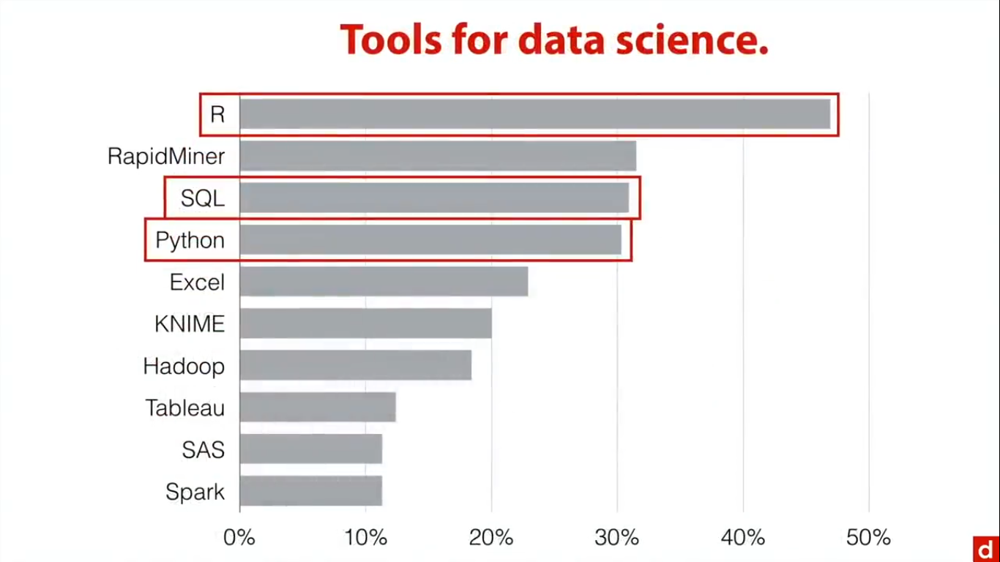


### Statistics
When it comes to Data Science, we cannot think of Statistics as a NOMA (Non-Overlapping Magisteria). Indeed, Statistics is a part of data science. However, most data scientists are not trained as statisticians. In practice, ML & Big data are not shared generally with Statistics. They have separate domains. Finally data scientists generally very often work in commercial settings to develop products that make money. Both fields analyze data but people in each tend to have different backgrounds and function with different goals & contexts.


### Business Intelligence
BI is data in real life. It is very very applied stuff. Its purpose is to get data on internal operations, market and competitors and make justifiable decisions. Data science is involved with this but BI does not include coding and its statistics are very simple (count, percentages, ratios). The focus here is on domain expertise and on really useful direct utility. One of the main associations is **dashboards** (collections of charts and tables that go together to give a very quick overview of what is going on in the business).
Data science can be useful to set up the framework for a BI system or for dashboards. It can help past easy questions and easy data to get the questions that are most useful even if they require data hard to wrangle. DS can learn design from good BI. 


## Ethical Issues
Please, **Do no harm** with your projects.

### Privacy
You shouldn't share confidential information from people (name, addresses, health, social security numbers, etc.) except if they give you permission for that. A lot of data used for data science was not created for sharing. Think of web scraping of pdf... Make sure you have the right to, if you want to share data.

### Anonymity
It is not hard to identify people in data. Before, **HIPAA**, the Health Insurance Portability ad Accountability Act, it was very easy to identify people from medical records.  Proprietary data may have identifiers. We should still maintain privacy and confidentiality of the data.

### Copyright
Scraping data (from webpages, pdf, images, audio, etc.) is common and useful but it is not always okay to use data just because it is on the Internet.

### Data security
We should be concerned about hackers trying to steal the data especially if it is not anonymous. The data should be safe.

### Potential Bias
If the rules & data used are biased (gender, race, ...), algorithms might replicate those biases.

### Overconfidence
Analyses are limited simplifications and there is a need of humans to help interpret them. Humility is in honor when doing data science work.


## Methods
Tech is simply the means to do data science, the goal being insights.
- Sourcing: How to get the data.
- Coding: Computer programming to obtain, manipulate and analyze the data.
- Maths: math behind the DS methods.
- Stats: statistical methods to summarize and analyze the data.
- ML: Methods for finding clusters, predicting categories and scores.
DS >>> Tech


### Sourcing
You have some options to get raw data:
- Existing data: in-house data from a company, open source data from governments or organizations, third-party data bought from a specific vendor.
- Data APIs: an Application Programming Interface allows applications to communicate directly with each other. It helps to import web data directly from the program we are using to treat data.
- Scrape Web data: For web data without APIs such as HTML, PDFs, we can use specialized apps or code with programming languages like R or Python.
- Make data: it helps to get exactly what we need maybe by interviews, surveys, or experiments.
No matter the method, we need to remember **GIGO**: *Garbage in, garbage out*. Bad data won't provide real insights. As a consequence, we need to pay attention to metrics Business metrics, KPIs (key performance indicators), SMART goals and classification accuracy. 

### Coding
It is any technology allowing to manipulate data in the way you need to perform the procedure you need to get the insights you want out of the data. There are threes categories:
- apps: specialized for working with data. There are Spreadsheets fundamental data tool, Tableau for data visualization, SPSS statistical package, JASP free open source version of SPSS.
- data: special formats for web data such as html, xml, json, etc.
- code: programming languages such as R, Python for general purpose, SQL for databases, C, C++ & Java used more in the back-end of data science, bash and regex.

Note that tools are just means, use them wisely. A few tools are enough, you should just focus on your goal, choosing the tools to match it.

### Maths
It is important because:
- you need to know which procedures to use and why
- you need to know what to do when things don't work right
- some math is easier by hand than computer
Math is to data science what chemistry is to cooking, kinesiology to dancing, or grammar to writing. You can be a wonderful cook without  know chemistry ut knowing some will definitely help.
The Maths you need:
- Elementary Algebra
- Linear (matrix) Algebra
- Systems of linear equations
- Calculus
- Big O: how fast it works
- Probability Theory
- Bayes' theorem

### Statistics
It is an attempt to find patterns in an overwhelming mass, order in chaos.
- We can explore data: exploratory graphics (it is easy to see things), exploratory stats (numerical exploration of the data), descriptive stats (stats in college)
- Inference: take information from sample and infer something about a population. One common version is hypothesis testing, and another one is estimation (confidence intervals)...
- we have to be concerned by details and arranging things by ourselves: feature selection, problems, validation to make sure the model is correct, choice of estimators (coefficients of the model), and how well the model fits the data.
Beware the trolls: you don't have to listen to people who think only their way is right. Remember George Box said: **all models are wrong, but some are useful**. The question is to know f you have done something that is useful.
Wave your DIY (Do It Yourself) flag.


### Machine Learning
Intersection between coding & stats. It can be used to categorize and predict information from data:
- work in a **data space** to reduce te dimensionality, and then use clustering or K-Means methods, and find anomalies or unusual cases in the data space.
- work with **categories** with algorithms such as logistic regression, kNN, Naive Bayes, Decision Trees, SVM or artificial neural nets, to find patterns in the data to get similar cases next to each other.
- **predictions**: linear regression, poisson regression for modeling count or frequency data, ensemble models putting together predictions from many simpler models.


## Communicating

### Interpretability
You want to tell a data driven story. When doing the analysis, we are trying to solve for **value**: $Analysis \times Max(Story) = Max(Value)$. Analysis is goal-driven. The explanation or story given about the project should match those goals. Answer clients questions clearly and unambiguously.
Remember the client isn't you, and think of:
- Egocentrism: They don't see, know or understand things the same way you do. 
- False consensus: ideas that everybody knows something.
- Anchoring: initial impressions matter a lot. Watch out.
- Clarity at each step.
Think of the **answers**: state the question, answer it, qualify as needed and go in order but don't spend too much time on discussing the process technically. 
The process is to remember that *analysis* means simplifying. According to Einstein: **everything should be made as simple as possible but not simpler**. Think of the minimum viable analysis:
- more charts, less text
- simplify charts
- avoid tables (they are hard to read)
- less text (again).
In 1973, graduate school admissions revealed that the male admission rate was higher than the female one: $44\%$ against $35\%$. It seems to a lawsuit. However after breaking the application down by programs, it was found that there are some programs were women were accepted in a higher rate and some they were not. In Statistics, this is known as **Simpson's Paradox**. The paradox is that bias might be negligible at department level but still there might be some bias there in favor of women. The problem is women applied to more selective programs. There are many other questions that can still be answered and things we can look for as admission criteria, promotional strategies, prior education and funding levels. 
In sum, stories give value to data analysis and should be told in a clear way, minimally sufficient.


### Actionable insights
Those are information that can be used productively to accomplish something. William James idea: **My thinking is first and last and always for the sake of my doing** applies to analysis. When doing an analysis, point the way (analysis guide action). You should be able to tell the clients what are the next steps (what they need to do now), justifying those recommendations with data. You should be specific and make sure they are able to do them sep by step. 
The problem here is the difference between **correlation** and **causation**. Data ives correlation (this is associated with that), but the client wants causation (this causes that). There are few ways to get that:
- Experimental studies: randomized controlled trials
- Quasi-experiments: methods that use non-randomized data for causal inference
- Theory & experience: research based theory and domain-specific experience
There are also social factors affecting the data.
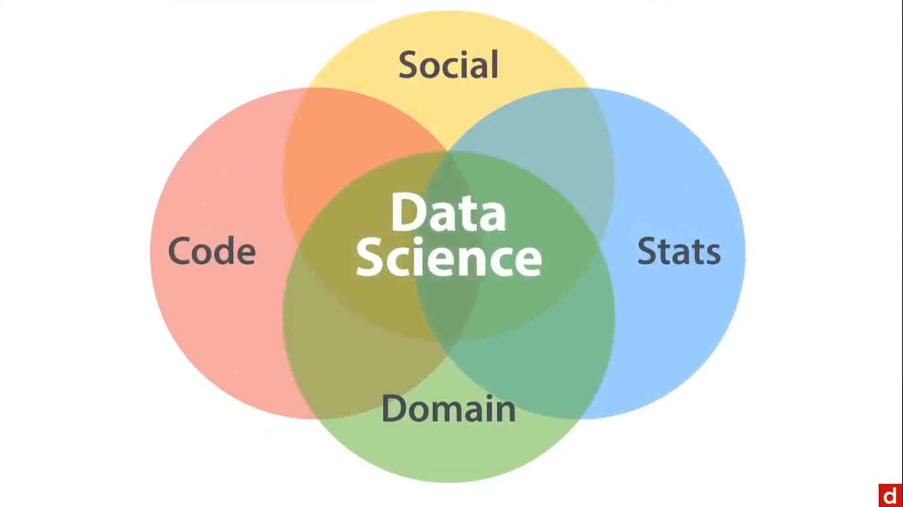
We should make sure our recommendation follow: the client's mission (what he does), identity (who he is), its business context (competitive environment) ut also the social context (outside and inside the company).

### Presentation graphics
Trying to paint a picture for the benefits of the client:
- Exploratory graphics: speed and responsiveness, for our insights.
- Presentation graphics: clarity & narrative flow. Avoid too much colors, 3D, interaction and animation as the client should not be distracted.

### Reproducible research
Data science projects tend to be incremental, cumulative and adaptive. So, **show your work**. You may need to revise your research later, or borrow something from previous studies, hand off to someone else, and also about accountability to show you did things in a responsive way. 
There is a platform called the [open data science conference](https://odsc.com/) devoted to open data science using open data and making methods transparent. The [open science framework](https://osf.io/) is a way of sharing data and research with annotations of how to get to the results. The [association for psychological science](https://www.psychologicalscience.org/) strongly encourages people to share their data as much as possible and their methods to conduct studies.
It is important to archive your data: both the totally raw and the processed, all code to process and analyze data, making sure to comment liberally and explain yourself (why you did the way you did, include choices and consequences, backtracking).
This helps to future roof you work. Some useful principles:
- Store data in non-proprietary formats, like csv
- Place files in accessible location like GitHub.
- Code: using dependency management: `packrat` for R, `virtualenv` for Python.
Putting the narrative in a notebook can help to explain yourself. R Markdown can be used for R code (docs can be uploaded as RPubs to be accessible online) and Jupyter Notebook for Python.


## Conclusion

Remember it is important to give people next steps. You can start doing some coding, visualization or learn some stats & maths or even ML. But try to keep wha you do in context. You can also get involved in a=one community of data science like O'Reilly Strata, Predictive Analysis World, Tapestry Conference, Extract by import.io. To start working a great choice is [kaggle](https://www.kaggle.com/). Once done, you might want to do some service: [DataKind](https://www.datakind.org/) is the premiere organization for data science as humanitarian service. Only remember that: data science is democratic. DATA SCIENCE NEED YOU!

---

# Data Sourcing
No data no data science. This course is about different methods to obtain data for analyses.

## Measurement

### Metrics
Data science is action oriented. The goal should be explicit and clear for the client and can help the analysts save time. It helps define success:
- commerce: sales, new customers
- edu: scores on test, graduation rate
- government: housing, jobs
- research: ability to serve the people we are trying to understand.
There are different metrics or ways of measuring:
- Business metrics: sales revenue, leads generated or new customers, customer value, churn rate (loosing and gaining customers)
- KPIs: a key performance indicator should be non-financial (measure the overall productivity), timely, ceo focus (senior management decide on them), simple, team-based, with significant impact (affecting more than one important outcome) and limited dark side (fewer possibility for reinforcing wrong behaviors).
- SMART goals: Specific Measurable, Assignable, Realistic and Time-bounded.
- Multiple goals: optimizing goals.
Many metrics can be used to know how well the goals are reached. When there are many there is a need to optimize them. 

### Accuracy
We can get many different ways of measuring the accuracy from a classification table.

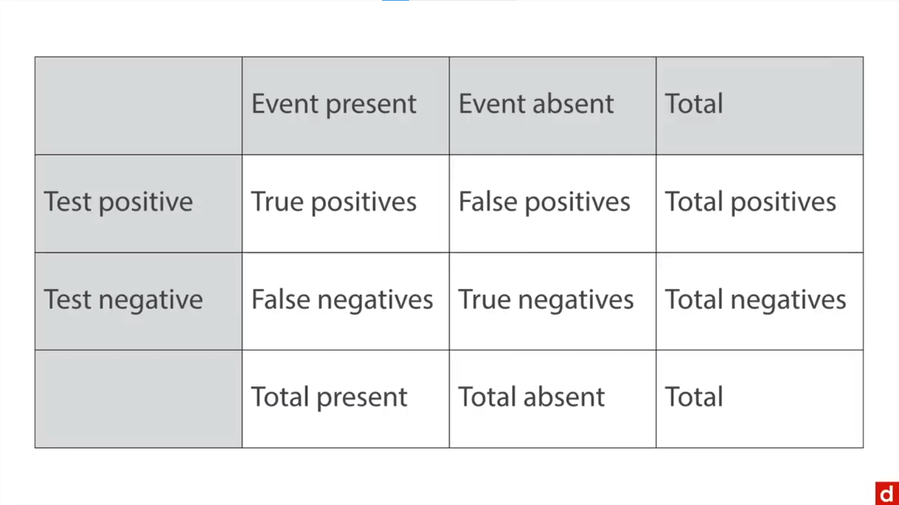

Some are:
- sensitivity: or recall or true positive rate. If there is a fire, does the alarm ring? You want to always have an alarm when there is a fire.
$sensitivity = tp / (tp + fn)$
- specificity: if there isn't a fire, does the alarm stay quiet? You want the alarm to stay quiet when there is no fire.
$ specificity = tn / (tn + fp)$
- positive predictive value: or ppv or precision. If the alarm rings, is there a fire?
$ppv = tp / (tp + fp)$
- negative predictive value: if the alarm doesn't ring, is there no fire?
$npv = tn / (tn + fn)$
The idea is to maximize an accuracy as much as we can. We want to maximize true positives and true negatives and avoid te false ones. 

### Social context of measurements
People are people and that can affect measurements:
- When making recommendations, it is important to respect the business model of the client organization (it's tied to their identity). 
- Some laws and policies or common practices may limit the way goal can be met.
- There is competition both between organizations as within.
- People generally exploit and game the system.
You should consider that to make the most out of your analysis.


## Getting data

### Use existing data
There are any different types:
- **In-house data**: proprietary data (from the organization or client company) can be fast and easy with hopefully appropriate format and good documentation, with good quality. There might be some restrictions.
- **Open data**: public (government, corporate or scientific) data that is prepared and freely available. Some example are : [US data](https://data.gov/), [Utah data](https://www.utah.gov/index.html), [EU data](https://data.europa.eu/en), [UN data](https://data.unicef.org/), [WHO data](https://www.who.int/data), [Pew Research Center data](https://www.pewresearch.org/datasets/), the [New York Times APIs](https://developer.nytimes.com/), [Google available data](https://datacommons.org/data/agriculture), [AWS Pubic datasets](https://aws.amazon.com/opendata).
Note that those datasets can be very valuable, well-formatted and documented, and also various. However, sometimes they require sharing analyses which is a concern when doing proprietary research. There might be biased samples because of Internet needs, or issue with privacy and confidentiality. The data meaning might also be unclear.
- **Third-party data**: purchased data (DaaS: Data as a service, or Data brokers) can give enormous data on many different topics, even processing data for us. Here are some data brokers: [Acxiom](https://www.acxiom.com/) primarily for marketing data, [Nielsen](https://www.nielsen.com/) primarily for media consumption and [datasift](https://www.datasift.com.tr/). Using data brokers can save time and effort, giving individual level data, and specific information. However, it can be expensive, still require a double-check, and people don't like using this option.

Always pay attention to the quality, the meaning and the usability of the data.


### Use APIs
Application Programming Interfaces allow programs to talk to each other. It allows your program to get web data. The most common version is called **REST API** standing for Representational State Transferred . It allows to access data on web page via *HTTP* (HyperTest Transfer Protocol). The data is downloaded in *JSON* (Javascript Object Notation) format, and can be sent directly to other programs using any programming language (as they are language agnostic).
There are **social APIs** for: Facebook, Twitter, Google Chat, FourSquare, Soundcloud; **visual APIs**: Google Maps, YouTube, AccuWeather, Pinterst, Flickr.
We can program APIs in **R**, **Python**, **Bash**, etc.

### Scraping data
Scraping data is pulling information from web pages. We use this technique when there is no immediate way to get the data we can see. From that we can scrape html text, or tables, pdf, and media. Always pay attention to copyright and privacy. There many ways to do web scraping:
- use apps: import.io, ScraperWiki, Tabula, Google Sheets, Excel.
- code your scraper with: R, Python, Bash, Java or PHP.
You are gonna be looking for information in web pages. If looking for **HTML Text**, you will pull structured text from web pages, using HTML tags like <*body*> <*h1*> or <*p*>. For **HTML tables**, you will use HTML table tags like like <*table*> <*tr*> or <*td*> but you need the table number that you mind find after trials and errors. You  can also scrape data from **pdf** (native: text pdf, or scanned: image pdf) by looking for text elements, dealing with raster/vector images and also with tabular data using special programs like Tabula or ScraperWiki. Finally we can scrape **media** like images, video or audio. To read the data, we might need a program looking pixel by pixel in each image.


### Making data
Can't find the data you need? DIY
Depending on your role to get the data (passive or active), the type of data you want (quantitative or qualitative) and how you want to et it (online or in person), there are some options:
- **interviews**: a conversation used for the most basic problem. When you are working with a new topic, a new audience, or you need to find ways to improve. You don't want to constraint responses. Interviews can be structured with predetermined questions or unstructured. They require time and training, and answers eed to be analyzed.
- **surveys**:  if you want to know something, just ask. Here you need to know enough the topic and the audience to anticipate the answers. You can have a *closed ended* surveys with forced choices, *open ended* ones, *in person* or *online*. Common applications for online surveys are **SurveyMonkey**, **Qualtrics**, **Google Forms** and **Typeform**. Note that when surveys are easy to set up, questions can be ambiguous, and response scales confusing.
- **card sorting**: important in web research. To do so, you write topics on cards, physically or digitally and ask people to sort those cards so that you can compute dissimilarity data (distance between topics). There are *generative* card sorting tasks where each respondent create their own sets, used to design websites, and *evaluative* where there is a fixed number of categories, used to check if the navigation is intuitive. You end up with a **dendogram**: hierarchical visualization.
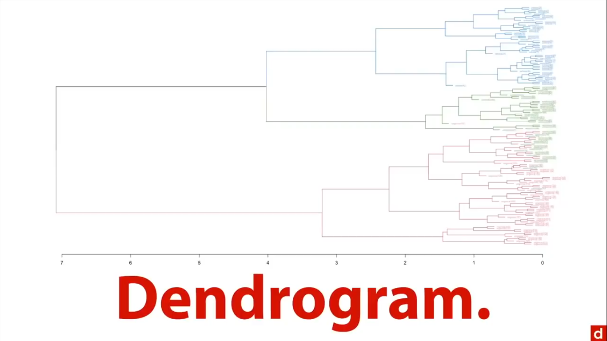
For digital card sorting, you can use Optimal Workshop, UserZoom or UXSuite.
- **Experiments**: *laboratory* where you design the situation, *A/B testing* an automated online testing of two or more variations. Lab experiments helps to determine better **cause and effects**. Here researchers can play an active role with manipulation. Experiments are focused research, hypothesis driven with random assignment to minimize of confounds and artifacts.
A/B testing : you create a multiple versions, randomly assign version to visitors, compare response rates (time on page, mouse tracking, clicks-through, shopping cart value, abandonment), and implement the best variation.  A/B testing can be performed continuously. There are some softwares to do it: **Optimizely**, **VWO**, etc.

## Conclusion
See what you already have, exploring some open data sources. Consider making new data if they don't give you what you need.

---

# Coding in data science

We are gonna take a look at tools in Data Science and their place.
Note that data science is much more than the tools involved. We will need at least a few tools.

For getting started, we need spreadsheets, Tableau for data visualization, the format used in web data (not a tool but very informative). Essentials tools include R for data, the general purpose programming language Python, and the database language SQL. Beyond that, there are the general purpose programming languages C, C++, Java used for high level production code, bash, and regex.
Don't forget the Pareto principle. It states that for many outcomes, roughly 80% of consequences come from 20% of causes.
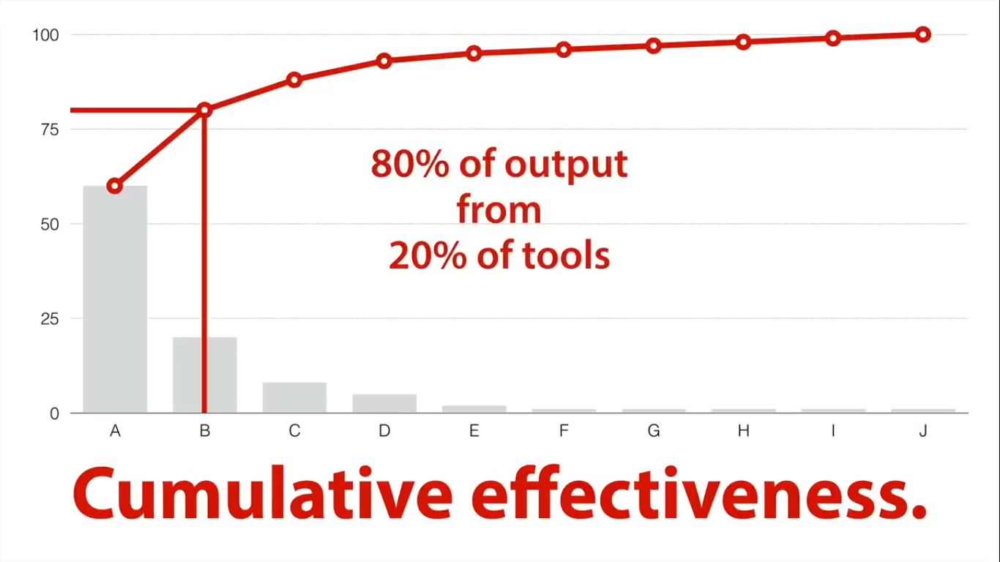
You don't have to know everything but you should focus on the tools that are going to be most productive for you.

## Applications
We will talk about programs created to manipulate data.

### Spreadsheets
They are easy to use and everywhere: a lot of companies use data in spreadsheets format. `.csv` is  sort of universal format for data transfer. Note that Excel is above Hadoop and Spark in the ranking of major big data fancy tools.
Spreadsheets are goof for data browsing, sorting and rearranging data, finding and replacing, formatting (conditional formatting), for transposing data (switching rows and columns), for tracking changes (even though you might be using GitHub for that), for making pivot tables (to explore data intuitively), for arranging the output for consumptions.
With spreadsheets, we need to make sure the data is **tidy** so it works well when transferring it. For that:
column = variable, row = case, one sheet per file, and one level of measurement (individual, organization, state) per file.

### Tableau
It is a visualization program. When we have data the most important thing to do is to look into that data. Tableau Public is the free version that publishes dashboards online.

### SPSS
Statistical Package for the Social Sciences is pretty big desktop program used in academic or medical research, business consulting and management. It is powerful but quite expensive.
SPSS looks like Excel but with much more options, and has a lot of sample datasets. It generates an output file that can be downloaded. Syntax files offer the possibility to copy code and save it as a text file, so to replicate analyses.

### [JASP](https://jasp-stats.org/)
It is the free version of SPSS. It is also open source, intuitive, making analyses replicable and it includes Bayesian approaches. The layout is similar to SPSS.
You can add the skewness or the kurtosis (measure of the presence of extreme values) in your data summary table. Note that you can also share the information online through [OSF (Open Science Framework)](https://osf.io/). 

### Other software
There is so much more:
- SAS: very powerful analytical program. The SAS University Edition is free for students. JMP is a visualization program from SASA.
- STATA, Minilab, Matlab, Mathematica (language)
- WolframAlpha: analyses, regression models, visualizations
- For data mining: RapidMiner, KNIME, Orange.
- For Machine Learning: BigML.
- SOFA (Stats Open For All) Statistics, Past 3, StatCrunch for basic stats and learning.
- XLSTAT: an add-in to get a lot of stats functions within Excel.

Note you don't even have to try all of them. You should just use what works for you. Think of functionality, ease of use, the existence of a community (to solve problems you'll face), the cost, all this to reach you goals.


## Web data

### HTML
**HTML** (Hyper Text Markup Language) is used to build the content of web pages from text and tags that define the document's structure. Some tags are: <*body*>...</*body*> for the text body, <*p*>...</*p*> for paragraphs, <*h1*>...</*h1*> for header 1, <*td*>...</*td*> for table data or the cell in a table. **CSS** (Cascading Style Sheets) helps to define the appearance of the document.

### XML
**XML** (eXtensible Markup Language) is semi-structured data, tags defining data so the computer knows what it is. Note that unlike HTML, the tags are free to be defined anyway we want. We will often see xml files in web data, Microsoft Office (.docx, .xlsx --> x for eXtensible), iTunes library information, data files. Tags also use opening and closing brackets: <*genre*>...</*genre*>. A right click on a web page followed by a left click on view page source helps to visualize the xml or html code of a web page. We can use APIs to access xml data and also convert xml data easily to different formats (xml to csv and vice versa, html to xml).

### JSON
Like XML, **JSON** (JavaScript Object Notation) is semi-structured data. When XML gives meaning to text and allows for comments and metadata in tags, JSON is specifically designed for data interchange, with a structure that corresponds with data structures: strings, dictionaries, etc.

It is really easy to convert between the formats.


## Languages

### R programming
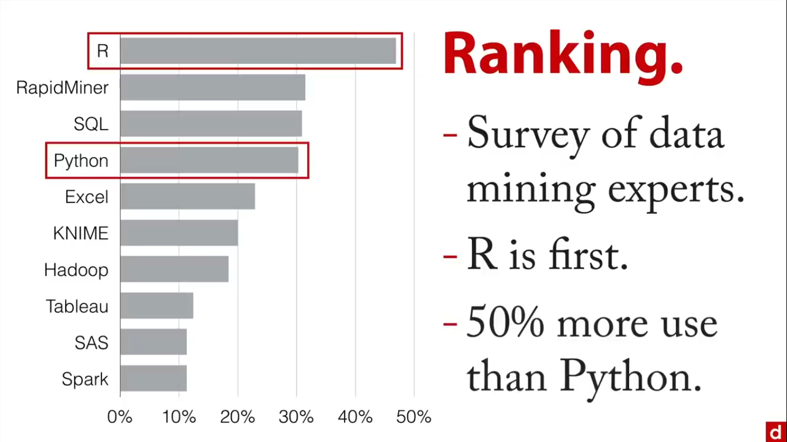
R is the language of data. It is free & open source, specially developed for vector operations, with a great community, and more than 7000 packages to add capabilities. For interfaces, you can use R's IDE or use the terminal directly, or R Studio.com, or even Jupyter. R is command line: you type lines of codes to get the commands outputs. It is nice for replicability.
The beauty of R is in the packages available to extend its capabilities:
- [CRAN](https://cran.rstudio.com/) (Comprehensive R Archive Network): organize packages in task views and for each one, we have datasets, manual in pdf formats and also vignettes illustrating examples.
- Crantastic: an interface that links to CRAN but that shows the popularity and updates of packages. Unfortunately, it was removed from the Internet.


### Python Programming
It is a general purpose programming language that can do it all. Python is built-in on Mac or Linux, and has a great community with thousands of packages. The only problem is there is some compatibility versions between Python versions. Python has its own IDLE, but you can run it from the terminal or from a jupyter notebook (IPython: for Interactive Python or Python in Jupyter). There are also Continuum Analytics now [Anaconda](https://www.anaconda.com/download) & Enthought Canopy now [Enthought Deployment Manager](https://assets.enthought.com/downloads/) that offers Python distributions. Python is also command line: we are typing line to code. Data Science loves Jupyter and Jupyter loves data science: text output and markdown, inline graphics, ease to organize & present in notebooks. The main Python repository is **PyPI** (Python Package Index). Familiar packages are Numpy & Scipy for scientific computing, Matplotlib & Seaborn for data visualization, Pandas for statistical analyses and scikit-learn for ML.


### SQL (Structured Query Language)
It is the language of databases (where the data is), that can be used i different applications. It is designed for relational databases, which are ways of storing structured data, and helps manipulate data s we can export them into analytical applications.
**RDBMS** are relational database management systems  where we usually manipulate data with SQL. Some free an open source versions are Oracle Database, Microsoft SQL Server, MySQL, PostgreSQL. Databases minimize redundancy by using connected tables. There are some graphical user interfaces (GUI) like: SQL Developer, SQL Server Management Studio, [Toad](https://toadworld.com/products/), etc. and also any command line interface or any interactive development environment or programming tool.
Some basic SQL commands are: 
```sql
Select -- to choose the case to include
From -- to specify the table
Where -- for conditions
Order by -- order to put them together
```
You don't have to be a ninja. Handful commands will be enough.


### C, C++, Java
There are most often seen in the bedrock: the absolute fundamental layer that makes the rest of data science possible.
**C** and **C++** are from 1960s and 1980s. They are widely used, and very fast and stable, which makes them suitable for production level code and sever use. They can be used in R.
**Java** is based on C/C++, and can be run anywhere (WORA: write once run everywhere). Its portability makes it the most popular language overall against all tech situations. When something has to be fast and should not break, it is generally used, and typically by engineers (for the back end of data science).


### Bash
It is accessible on the command line interface: which is only a method of interacting. Shells are languages that help the user interact with the operating system. On Macs & Linux, the most common is **Bash**: Bourne Again Shell. On Windows, there is **PowerShell**. There are other versions: Bourne Shell, C Shell, Z Shell, fish, etc.
Good to know:
- $ indicates the prompt (type your command here).
- We type one line at a time.
- we can run scripts to execute more than one line.
In Bash, there are utilities (specific programs accomplishing specific tools). There are tw categories of utilities:
- **Built-ins**: *cat*: catenate to put information together, *awk* for text processing, *grep* for global search with a regular expression and print, *sed* for stream editor, to transform text. Some others are *head* & *tail*, to display the first or last lines of a document, *sort* & *uniq* to sort and count unique answer in a document, *wc* for the words count, and *printf* to format the output in the console.
- **Installables**: *jq* for pulling in json data from the web, *json2csv* for file conversion, *Rio* to run R commands as part of bash, *BigMLer* to access BigML server through the command line. 

Utilities are fast easy and very practical.


### Regex
To be able to find the things you are looking for, regular expressions is a great method. Regular expressions are a form of pattern matching in text. We can write specific or very general patterns to search data and export it elsewhere for analyses. To search for text, in all text files in ".txt" format, that start with "l" and then continues with one character following, and then with "ve", we can write:
```bash
grep ^l.ve *.txt
```
In terms of the actual notes involved in regular expressions, there are certain elements:
- **literals**: that mean exactly what they are, i.e: "l"
- **metacharacters**: sort of characters specifying things need to be there, i.e: "."
- **escape sequences**: to look for a period as opposed to a placeholder, i.e: "\n"
- **search expression**: the expression created, i.e: "^l.ve"
- **target string**: the thing we are searching through, i.e: *.txt for files when using grep.
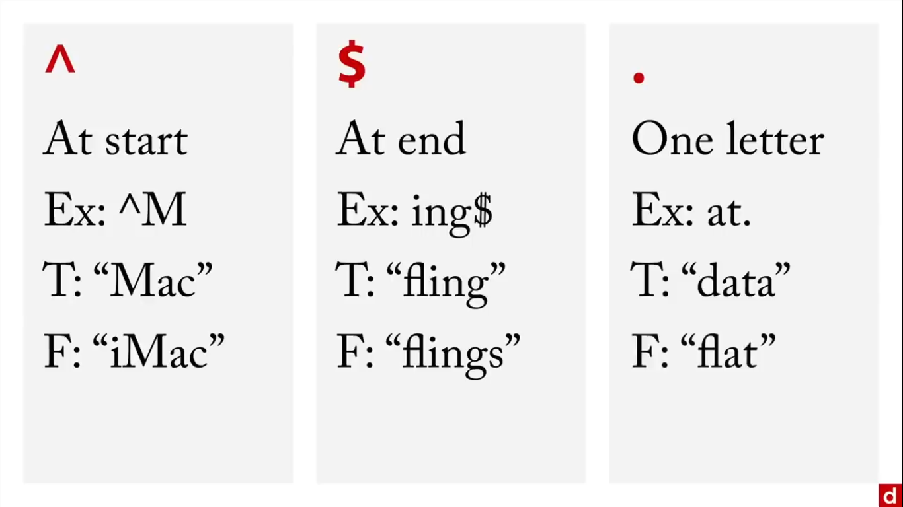
[Regex Golf](http://alf.nu/RegexGolf) is a nice platform to play with regular expressions.


## Conclusion

You can start working with some tools but remember t=data tools are different from data science. Data Science is much more!!! Tools are just means and you do not need to know all of them. Focus on what is most suitable to you and your goals of extracting meaning from data. Here are some recommendations:
[Tools Recommendations](images/coding_tools.png)

---

# Mathematics in data science
Math matters to data science. There are few ways why it does:
- it allows to know which procedures to use and why, to answer questions in the best way.
- it helps to know what to do when things don't work right.
- some math is easier by hand than using computers
Which math?
- Algebra: We will focus on three kinds: Elementary algebra (regular $x + y$), linear (matrix) algebra (used by computers for calculations), systems of linear equations.
- Calculus, Big O (speed of complexity of operations), probability theory, Bayes theory (changing the way analyses are interpreted using posterior probabilities).
Remember: You can do it!

##  Foundations
### Elementary Algebra
Nothing is more foundational than elementary algebra. Algebra means restoration. Algebra aligns to combine multiple scores, get a singe outcome, with calculations easy for one case at a time, especially when doing it by hand. For example, it is possible to determine an output i.e a salary in function of some parameters i.e constant (base salary), years of experience, bargaining skills, number of working hours and an error term.
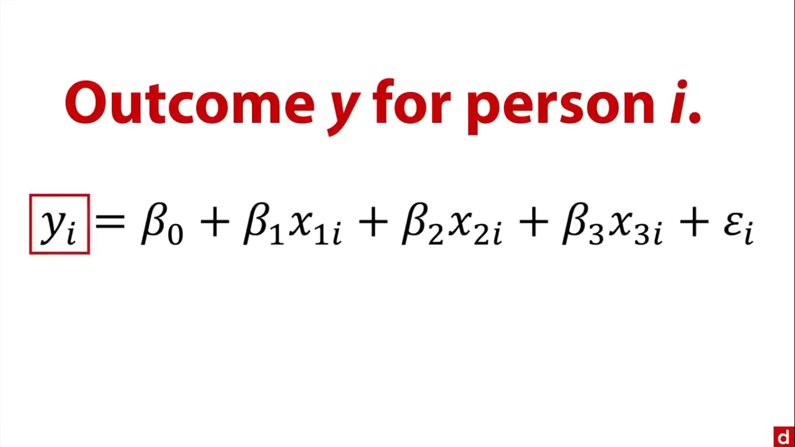

### Linear Algebra
Welcome to the matrix! There are some terms we need to be familiar with:
- scalar: one number.
- vector: row or column of numbers, that can be treated as aa collection (usually a variable).
- matrix: many rows & columns.
Machines loves matrices as they understand numbers. We can used them to compute outputs for many cases.
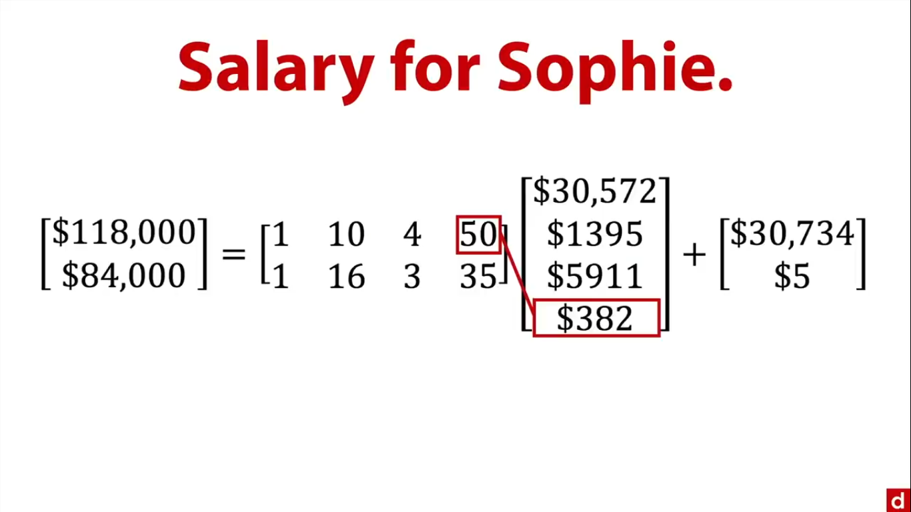
We then get the matrix notation:
$$Y = X\beta + \epsilon.$$
with $Y$ the vector of outcomes, $X$ the entire matrix of people parameters values, $\beta$, all te regression coefficients, and $\epsilon$ the error term vector.

### Systems of linear equations
There are times you try to solve many unknowns simultaneously, knowing a lot of them are interlocked ($X$ depends on $Y$, and at the same time, $Y$ depends on $X$). Funnily, it is actually easier to solve that by hand and we can also use linear / matrix algebra to do it. For example, let's imagine $1000$ iPhone cases were sold, some for $\$20$, others for $\$5$, making $\$5,900$. The question is: how many were sold for each price? We can get a solution by designing a system of linear equations:
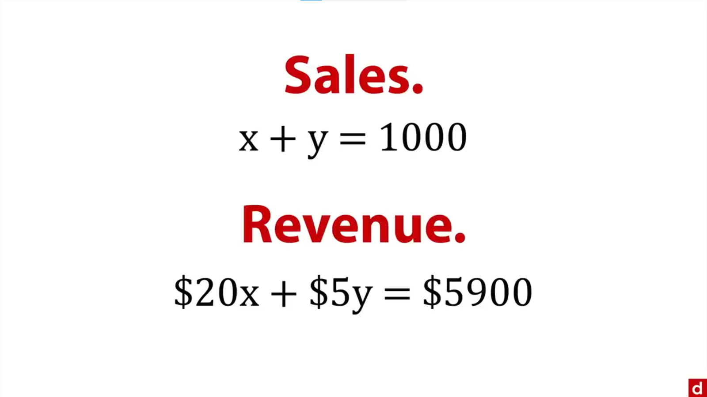
Solving that help us to understand $60$ cases were sold at $\$20$ each and $940$ at $\$5$ each. The solution can also be obtained by drawing: 
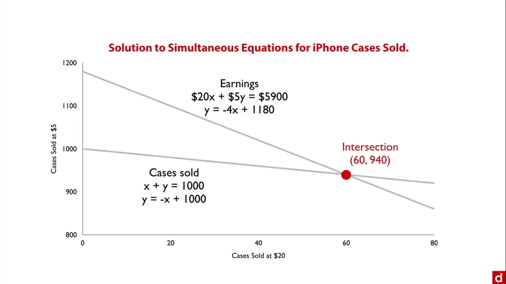

### Calculus
Formalized by Newton and Leibniz, Calculus is the latin for stone (as those used for tallying). Importance of Calculus in data science:
- Basis: Least square regression, probability distributions, etc.
- Change: measuring quantities or rates that change over time.
- Min/Max: finding maxima & minima functions in optimizing.
There are two kind of calculus:
- Differential calculus: or calculus of change to talk about rates of change at specific time.
- Integral calculus: or calculus of accumulation, to calculate the quantity of something at a specific time, given the rate of change. 
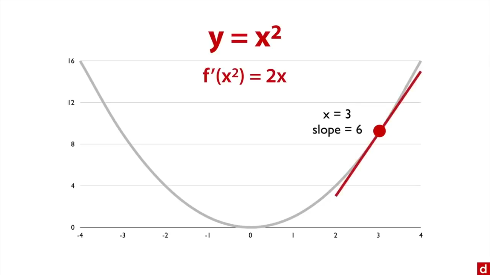
The slope at any given point of a curve is given by its derivative. We can use these procedures to optimize decisions.


### Calculus & Optimization
The place where Math meets reality. Calculus makes it possible to find values that maximize or minimize outcomes. For example, if you want to maximize your revenue from pricing online dating services, you can use calculus. Let's say annual subscriptions cost \$ $500$ a year, and you usually sell 180 new ones per week. Based on some experience, you know that for each \$ $5$ discount  from the subscription cost, you will get $3$ more sales. We will also assume there is no increase in overhead.
This said , let $d$ the number of \$ $5$ discounts, we get as mathematical expressions for the price: \$ $500$ - \$ $5d$, and for the number of sales: $180 + 3d$. The goal is to maximize the final revenue which is the product of the number of sales by the price of each subscription. To do so, we can first write sales ($y$) as a function of price ($x$). For tat, we will get both the Y intercept and the slope of the function. The $y$ intercept indicate the value of the function when x is 0. If $x=0,$ then \$ $500$ - \$ $5d = 0 \Leftrightarrow d = 100.$ Thus the $y$ intercept value is given by: $180 + 3(100) = 480.$ Now that we have $y$ intercept, we can find the slope of the function. The slope is defined by: change in $y$ by the change in $x$. This change in our case is function of the number of discounts $d$.
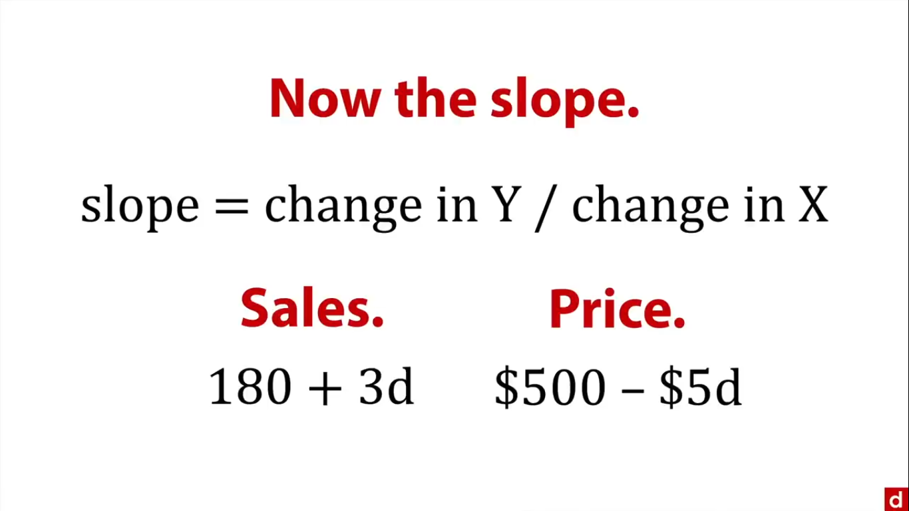
This said, the slope value is $+ 3 / (-5) = - 0.6$. We then have sales as a function of price: $\text{Sales} = 480 - 0.6 \text{ price}$. Now, we can have the revenue expression:
$\text{Revenues} = \text{sales} * \text{price} = (480 - 0.6 \text{ price})\times\text{price} = 480 \text{ price} - 0.6 \text{ price}^2.$ For maximizing our revenue, we will get the derivative of its expression in function of price. It's: $480  - 1.2 \text{ price},$ and solve that for $0$ as it will give us the place where the revenue is at its maximum (when the slope is equal to $0$). The optimal price is then \$ $400$, which give a sales volume of $240$ for a maximal revenue of \$ $96,000.$ Note that this represents  a $7\%$ increase of revenue from the original price of \$ $500$ for $180$ subscriptions per week. In sum, using calculus allowed to lower the cost of each subscription, increasing the sales and the total revenue.

## Data principles
### Big O
Big O is about time: the speed of operations. "O" for order as the growth rate of a function is called its "order". Big O gives the rate of how things grow. Some kinds of growth rates (Big O):
- The simplest: **O(1)**, the constant order: takes a certain amount of time no matter what. Sending an email to 10,000 = as for 1 person.
- The logarithmic order: **O(log(n))** there is a small increase in function of the number of elements or operations. Ex: finding an item in a sort array.
- The linear order **O(n)**: each operation takes a same unit of time, i.e: 50 operations - 50 amounts of time.
- The log-linear order **O(n log(n))**: it takes longer as you should multiply the number of items by its $log$. Ex: Fourier de Transform.
- The quadratic order **O($n^2$)**: Ex: multiplying $2$ numbers of $n$ digits takes a while.
- The exponential order **O($2^n$)**: really demanding, i.e finding an exact solution to the traveling salesman problem, using dynamic programming.
- The factorial rate of growth **O(n!)**: hugely demanding. i.e: 
finding an exact solution to the traveling salesman problem through the blues fold search.
Some methods are more variable than others. For example, when you consider sorting methods, the **insertion sort** is linear in its best day but quadratic averagely, when the **selection sort** is quadratic both in its best version, and averagely. 

The most import thing is to be aware of the demands so we can get the answers needed in the right time.


### Probability
To answer to the question: what are the odds of something?
The principles of probability:
- They range from $0$ to $1$.
- $P(A) = $ probability of the event $A$.
- $P(S)$, the probability space is all the probabilities together and gives $1$.
- The probability of the complement of $A$ is $P(\sim A) = 1 - P(A).$
There are also conditional probabilities:
- A conditional probability, probability of $A$ given $B$ $P(A|B) =$ Probability of $A$ if $B$ is true.
- We meet them a lot in hypothesis testing with probabilities of Type I & II errors.
Some arithmetic with probabilities:
- **For adding probabilities:**
$P(A \text{ or } B) = P(A) + P(B) - P(A ~\&~ B)$. Note that when the events $A$ and $B$, are disjoints, they never occur together, which means $P(A ~\&~ B) = 0$ and then $P(A \text{ or } B) = P(A) + P(B).$
- **Multiplications for probabilities:**
We want to get joint probabilities: the probability of two things occurring together simultaneously.
$P(A ~\&~ B) = P(A) \times P(B|A)$ but if A and B are independent 
$P(B|A) = P(B)$, and then $P(A ~\&~ B) = P(A) \times P(B).$

---

# Statistics in data science
We can use Statistics to see the unseen in data. Why Statistics matters: counting is easy but summarizing and generalizing are hard. Also, all analyses really depend on the example we are dealing with. The way you explain the difference between words for example, let's say: chess and programming, depend on who you are talking to, your goal, and the shared knowledge. There is not a single answer. Can you for example safely describe all of Agatha Christie's books? Can you predict the behavior of all the voters in Cameroon from Twitter $237$ posts?   
There are different methods that can be used in Statistics: Descriptive Statistics, Inferential Statistics, Hypothesis testing, and Estimation. A lot of choices has to be made: choice of estimators, different measures of fit, feature selection (to know which variable are more important in predicting the outcome), common problems when trying to model data, and model validation.
Remember: Analysis is functional, designed to serve a particular purpose. As George Box said: "all models are wrong, but some are useful." You are not trying to be totally accurate, but to be better off dong your analysis.

## Exploring data
### Exploration overview
It is important to see what the dataset is like to check if assumptions are met, so we can do a valid analysis with our chosen procedure. EDA helps to listen to the data, to pay more attention f something doesn't work as expected.
We can do:
- a graphical exploration: using visualizations to explore the data as graphs are dense in information and give a great overall impression. This includes doing: bar charts, histograms scatter plots, etc.
- a numerical exploration: second step to get more precision, it is an opportunity to tray variations and some methods: maybe some transformation on the data. This includes transforming the data (maybe with the logarithmic of their numbers to make them more normal, or reduce the skew if any), some empirical estimates of population parameters, robust methods.
Exploration helps to know the data, and listen to it. It is important before modeling.

### Exploratory graphics
You can see a lot by just looking. It gives a feel of data: how it is distributed, its shape. It also allows to check for assumptions, and anomalies (outliers, unusual distributions), and get suggestions (maybe we should do a deeper analysis). We usually do graphics first, for a couple of reasons:
- they are very information dense
- humans are visual
- it is the best way to check for shape, gaps, and outliers
We can graphically explore the data in different ways: Code (R, Python, Javascript), Apps (Tableau, Qlik, Excel) or by hand (refer to John Tukey's book).
The process for doing  these graphics is as follow: 
- For one variable (univariate distributions): we can use bar chart when dealing with categories; they are really easy to read, and can be ordered. We an also use a box plot when ewe have quantitative variables (something that is measured). Box plots show quartile values and also outliers. It can be used to show many variables side by side if they are on a similar scale. For quantitative variables, we can also use histograms, this time to see the shape of distributions, and maybe compare many.

- For two variables at a time (bi-variate distribution or joint distribution): we can group bar charts & box plots. It is a good way to see the association of categories and a quantitative variable. We can also do a scatter plot when we have two quantitative variables. It helps to check if the relation is linear, if there are outliers, and also the strength of the association (how close are the dots from a regression line).

- For many variables (multi-variate distribution): avoid doing 3D graphs as they distract more than they provide information, and can be hard to control (they need to be in motion). They might be useful however for clustering. It is better to use a matrix of plots. We can add markers for groups and it is clearer than 3D.
 
The goal of this exploration is to know if we have the data that we need, if there are clumps or gaps, if there are exceptional cases or errors in the data. In sum, it is a critical step, where we use quick and easy methods.

### Exploratory Statistics
It is the numerical or quantitative exploration of the data, which allows to get empirical estimates (population parameters as opposed to theoretical based ones), helps manipulating the data (looking subgroups, or transforming variables), and checking the sensitivity of results.

- Robust Statistics: stable estimates which are less affected by outliers, skewness, kurtosis, or any anomaly in the data. Some robust statistics are the: **trimmed mean** (throwing a certain percentage of the data from the top and the bottom), and the **Winsorized mean** (moving a certain percentage of the data from the top and the bottom, to the highest non-outlier score). Note that when trimming $50\%$ of the data both from the top and bottom we get the median.

- Resampling: that is an empirical estimate of sampling variability. There are several versions of this: Jackknife, bootstrap, permutation. The basic principle of resampling is key to cross-validation.

- Transforming: the idea is to take a difficult dataset and perform smooth functions (functions without jumps in it). They help preserving the order, keeping the full data set, while fixing skewed data, and curved lines.
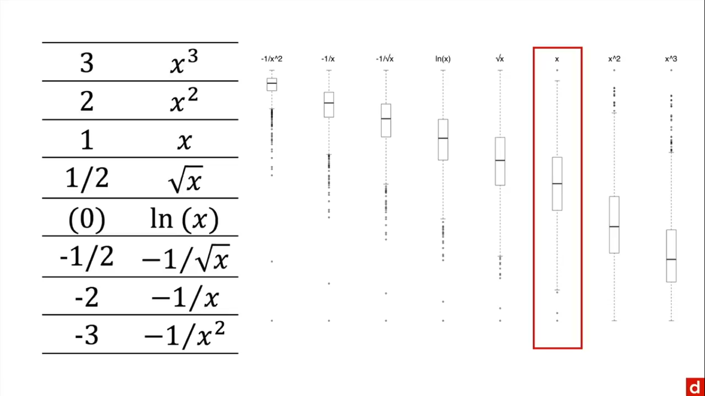
Those functions help to get back to a more centrally distributed distribution.

Exploratory Statistics help to get multiple perspectives on the data, check the stability and get ready for modeling.


### Descriptive Statistics
It is about trying to use a little data (few numbers) to stand in for a lot of data. We want to describe:

- the center of the data distribution:  mode (most commonly occurrence score/observation but may not be close to what seems t be the center of the data), median (place at the number line or observation that splits the data into two group, but hard to use as information), mean ($m = \dfrac{\sum{X}}{N}$: the sum of scores divided by the number of scores), etc. Note that the mean is the least intuitive and it follows the extreme scores: as more affected by the skew of the data, but it is the most useful one.

- the spread (dispersion or variability): the range (it is the maximum score minus the minimum one, easy to compute but strongly affected by outliers). The percentiles & inter-quartile range (the IQR is the distance between the third quartile score or $75\%$ percentile and the first one or $25\%$ percentile) are good for skewed data as they ignore extreme scores. The variance (the average square  deviation from the mean: $Var = \sum{(X - M)^2}/N$) & standard deviation ($std = \sqrt{Var}$) are least intuitive and the most affected by outliers but are also the most useful. Those formulas are slightly different from populations and sample but give similar values.

- the shape of the distribution: symmetrical (the same at the left and the right) or skewed (most data is on one end and outliers are on the other end i.e the positive or right skewed lacks data at the right), uni-modal (means there is only one mode in the data with contrast to bimodal where there are two) or Uniform (where every response is equally common), the U-shaped distribution (people piling up in one end and the other with a big deep in the middle). The shape of the distribution helps understand the numerical summaries and put them into context.

## Inference
### Hypothesis testing
The idea is to start with a question: "what is the probability of $X$ by chance if randomness / meaningless sampling variation is the only explanation?" and the response is: "If probability of data arising by chance is low, then reject randomness as a likely explanation." It is really common in Scientific research , and can be very useful for medical diagnosis, or anytime we are trying to make a Go / no go decision.
For hypothesis testing, you need to have:
- a null hypothesis ($H_0$): no systematic effect between groups, and random sampling error is the only explanation.
- an alternative hypothesis: systematic effect, correlation between variables.
We have to decide whether to retain or reject the null hypothesis but things can go wrong:
- false positive: when the sample shows some kind of statistical effect but it's randomness. That's conditional on rejecting the null. It's a Type I error. Most common value to reject the null hypothesis is $0.05$
-  false negative: when the data looks random but it's systematic. It's conditional on retaining the null hypothesis and is called type II error. It needs to be calculated.

The problem wit hypothesis testing s that it is really easy to misinterpret:
- a statistical meaningful result is confound with the sample size. It doesn't mean it is something big or meaningful.
- assumption of a null or nil effect: zero effect at all and in some situations it can be an absurd claim.
- Bias from cutoff: anytime there is a cutoff, there are problem where there are cases slightly lower or higher.
- some just try to answer the wrong question: instead of looking the probability to get the data at random.


### Estimation
It is designed to give a number, an estimate for a parameter we are trying to geth. The most common for it is confidence intervals. It is still an inferential procedure. But here we focus on likely values. It is useful to estimate any sample statistic. There are few versions: parametric vs. bootstrap methods: to randomly sample the data to get an idea of the variability, central vs. noncentral confidence intervals in estimation.

We need to choose a confidence level between 0 and 1 exclusive. $95\%$ is the most common. It gives a range of numbers: high and low. The higher he level of confidence the wider the range will be.

There is a trade off between accuracy (on target interval that contains the true population, leading to the correct inference) and precision (a narrow interval: a small range of likely values, independent of accuracy).
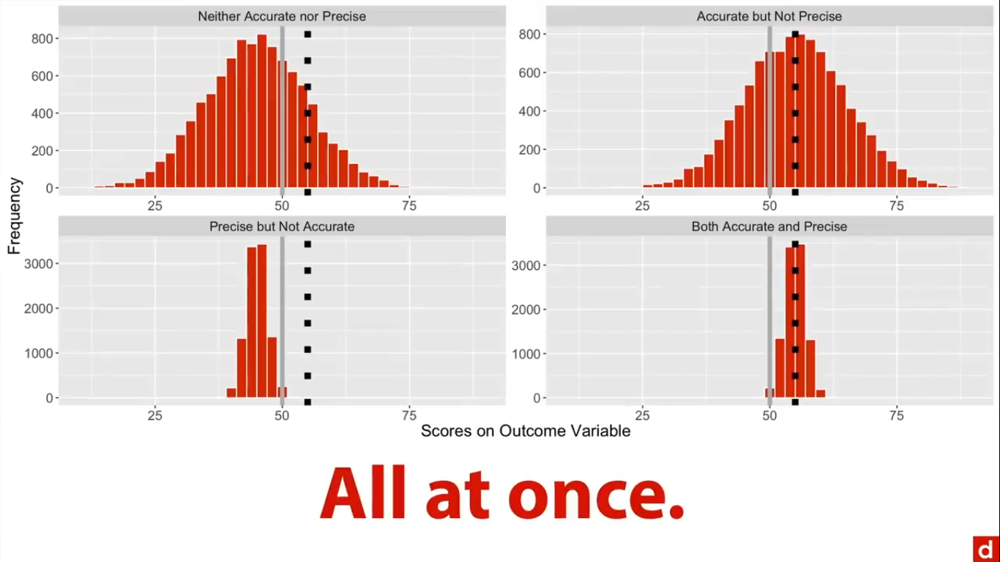
No matter what you do, you should interpret confidence intervals. 
Example:
- Result: the $95\%$ confidence interval for the mean is $5.8$ to $7.2$.
- Colloquial: there is $95\%$ chance that the population mean is between $5.8$ and $7.2$. But in frequentist statistical procedures, it implies that the population mean shifts and that's not how people see it.
- Better: $95\%$ of confidence intervals for randomly selected samples will contain the population mean.

Remember:
Higher confidence levels create wider intervals. The moe certain you want to be, you are gonna give them a wider range. Larger standard deviations create wider intervals. If what you study is inherently variable, then your estimate of the range will be variable as well. Larger sample sizes create narrower intervals.

Confidence intervals, most common version of estimation, focus on the population parameter, the variation of the data, being included in that estimation. They are more informative as they tell us wether the population value is likely but they give a sense of the data itself, which is why people argue they should be included in any statistical analysis.

## Choices
### Estimators
That is different methods for estimating parameters: 

- **OLS**: Ordinary Least Squares is a very common method used in a lot of statistics and based on the sum of squared errors. It is characterized by BLUE (Best Linear Unbiased Estimator)

- **ML**: Maximum likelihood: when you choose parameters that make the observed data most likely. It's based on a local search and so, does not always find the best match.

- **MAP**: Maximum a posteriori is a Bayesian approach that add a prior distribution and goes through an anchoring and adjusting process. 

Those three standards connect together. **OLS** is equivalent to **ML** wit normally distributed errors, and **ML** to **MAP** with a uniform prior distribution.

The choice of method depends on your goals and what suits best to your data.

---