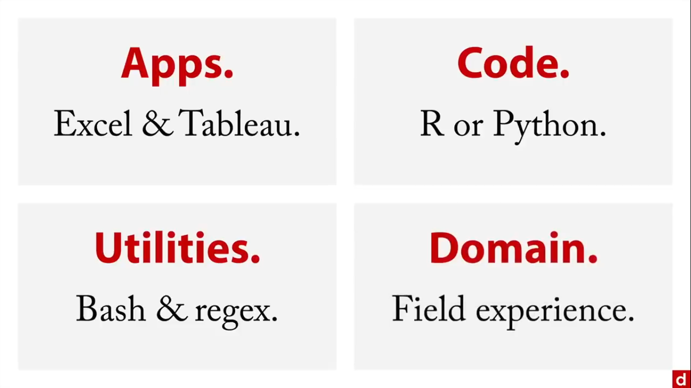

## 📚 [Learn Data Science Tutorial – Full Course for Beginners](https://www.youtube.com/watch?v=ua-CiDNNj30&list=PLWKjhJtqVAblQe2CCWqV4Zy3LY01Z8aF1&index=1&t=1416s)

**From Barton Poulson**

---

# Introduction to Data Science ✨
Data science isn't just a techy discipline with math and labs. It's a **creative** pursuit, combining coding, stats, maths, and domain expertise to **solve problems** and **extract insights**. Listen to your data closely, because **everything signifies**.

This course 🚀 gives you a roadmap for using data science effectively.

## 📖 Definition of Data Science
> Data science is applied coding, math & statistics; it is the art of analyzing diverse data with creativity and rigor.

### 🎯 The Data Science Venn Diagram
According to Drew Conway, data science lives at the intersection of coding (computer programming, hacking), stats & maths (quantitative abilities) and domain expertise (intimate familiarity with a particular field):

1. **Coding**: Creatively gathering & prepping data from various sources: statistical coding (R & Python), database manipulation (SQL), command line interface (bash), and search (regex: regular expression) 🖥️

2. **Math & Statistics**: Probability, algebra, regression, etc. to choose appropriate methods for handling data & to diagnose issues. 📊

3. **Domain Expertise**: Deep knowledge of the field's goals, methods & constraints. 💡

<small>*Inner-circles emerge from combining two of these ingredients:* ML, Traditional Research, and the Danger Zone.*</small>


#### 🔄 Inner-Circles Explained
- **ML**: Coding + Math, but no domain expertise. Pure algorithms 🤖
- **Traditional Research**: Math/Stats + Domain, but no coding. Data is already structured and ready for analyses 📑
- **Danger Zone**: Coding + Domain, but no math. Risky for valid inferences⚠️ but can be used for drawing maps and counting words.

### 🛤️ The Data Science Pathway
1. **Planning**: Define goals, resources, schedule & success criteria 🗺️
2. **Data Prep**: 🎯 Collect, clean, explore & refine your data (add variables, filter cases).
3. **Statistical Modeling**: Build, validate, evaluate & refine models 🔍
4. **Follow-up**: Present to stakeholders, deploy (e.g., on a website), monitor (as data might change over time) & document for reproducibility 📈

### 🤝 Roles in data science
Data science is a collaborative thing where people work together to achieve a goal.

- **Engineers**: Backend, hardware, software foundation 🛠️
- **Big Data Specialists**: CS + math, build ML-driven data products 🌐
- **Researchers**: Domain-focused and good statisticians 🔬
- **Analysts**: Day-to-day tasks like SQL queries and web analytics 📊
- **Business People**: Frame questions, manage projects & "speak data" 💼
- **Entrepreneurs**: Build data startups using both data & business skills 🚀
- **Full-Stack "Unicorn"**: Expert in everything… still mythical! 🦄

<u>**NB:**</u>
The unicorn is a mythical creature with magical abilities. In data science it is a mythical data scientist with universal abilities. No unicorns (*yet*), just people. Hence, there is a need to build teams to deliver data science projects. To build a good team, we take people with different skills so that together they can form a kind of unicorn: a <b>unicorn by team</b>.

## 🔍 Contrasts & Contexts
### 💾 Big Data vs. Data Science
- **Big Data's 3 Vs**: Volume (big quantity of data), Velocity (high speed with which data is generated) & Variety (data in different formats).
- **Big Data without Data Science**: Big data without all 3 V's or Raw scale without domain-driven insights 📉
- **Data Science without Big Data**: Data with just one V's. Traditional datasets (e.g., genetics) can still benefit from Data Science methods 🔬
- **Big Data Science**: Combining both for maximum impact.


### 👩‍💻 Coding
Coding is like a recipe for computers: input ➡️ instructions ➡️ output. Essential for data wrangling, but **statistics** is needed for valid inferences 🍳

> Top Data Science tools aren't only languages: think Excel, Tableau, SPSS, JASP, etc.


### 📈 Statistics
When it comes to Data Science, we cannot think of Statistics as a NOMA (Non-Overlapping Magisteria). Indeed, Statistics is part of Data Science, but most data scientists aren't pure statisticians. ML & Big Data often live in separate ecosystems. Finally, DS practitioners apply stats to build commercial products 💡
Both fields analyze data but people in each tend to have different backgrounds and function with different goals & contexts.

### 📊 Business Intelligence (BI)
BI is data in real life. It is very very applied stuff. Its purpose is to get data on internal operations, market and competitors and make justifiable decisions. Data science is involved with this but BI does not include coding and its statistics are very simple (count, percentages, ratios). The focus here is on domain expertise and on really useful direct utility. One of the main associations is **dashboards** (collections of charts and tables to give a very quick overview of what is going on in the business).
When BI focuses on simple metrics (counts, ratios) and dashboards to inform decisions, Data Science can design the analytical framework behind BI, elevating it beyond simple reporting 📉➡️📈  

## ⚖️ Ethical Issues
1. **Privacy**: Never share confidential info without permission 🔒
2. **Anonymity**: Re-identification is easy, safeguard identities 🕵️‍♂️
3. **Copyright**: Scraping data may violate IP rights 📜
4. **Data Security**: Protect against hackers and breaches 🛡️
5. **Bias**: Guard against gender, race & other biases in rules & data ⚖️
6. **Overconfidence**: Models only simplify. Human interpretation remains crucial 🤔

> Please, **Do no harm** with your projects. 

## 🔧 Methods & Workflow  
DS >>> Tech: Technology simply give means to do data science, the real goal being insights.
- Sourcing: How to get data.
- Coding: Computer programming to obtain, manipulate and analyze data.
- Maths: Mathematics behind the Data Science methods.
- Stats: statistical methods to summarize and analyze data.
- ML: Methods for finding clusters, predicting categories and scores.  

### 1. Sourcing
- **Existing Data**: In-house (from a company), open-source (from governments or organizations), third-party (from a specific vendor) 🌍
- **APIs**: Direct programmatic access to web data via Data Application Programming Interfaces 🔗
- **Web Scraping**: HTML, PDFs via R/Python or specialized apps 🕸️
- **Primary Data**: Getting exactly what you need via surveys, interviews or experiments 📝

> **GIGO**: Garbage In, Garbage Out -> quality data = quality insights.

### 2. Coding
It is any technology allowing to manipulate data in the way you need to perform the procedure you need, to get the insights you want out of the data. There are threes categories:
- **Apps**: specialized for working with data. There are Spreadsheets fundamental data tool, Tableau for data visualization, SPSS statistical package, JASP free open source version of SPSS.
- **Data Formats**: special formats for web data such as HTML, XML, JSON, etc.
- **Code**: programming languages such as R, Python for general purpose, SQL for databases, C/C++ & Java used more in the back-end of data science, bash and regex.

> Note that tools are just means, use them wisely. A few tools are enough, you should just focus on your goal, choosing the right tools to match it.

### 3. Math
It is important because you need to know which procedures to use and why, what to do when things don't work right, and some math is easier by hand than computer. Math is to data science what chemistry is to cooking, kinesiology to dancing, or grammar to writing. You can be a wonderful cook without knowing chemistry but knowing some will definitely help 🍳🔬  

The Maths you'll need:
- Elementary Algebra
- Linear (matrix) Algebra
- Systems of linear equations
- Calculus
- Big O: how fast it works
- Probability Theory
- Bayes' theorem

### 4. Statistics
It is an attempt to find patterns in an overwhelming mass, order in chaos.
- We can explore data: exploratory graphics (it is easy to see things), exploratory stats (numerical exploration of the data), descriptive stats (stats in college)
- Inference: take information from sample and infer something about a population. One common version is hypothesis testing, and another one is estimation (confidence intervals, etc.)
- Validation: Feature selection, estimator choice & model fit.
Beware the trolls: you don't have to listen to people who think only their way is right.

> "All models are wrong, but some are useful." - George Box

The question is to know if you have done something that is useful. Wave your DIY (Do It Yourself) flag.


### 5. Machine Learning
It is the intersection between coding & stats, that can be used to categorize and predict information from data:
- Work in a **data space** to reduce the dimensionality, and then use clustering or K-Means methods, and find anomalies or unusual cases in the data space.
- Work with **categories** with algorithms such as logistic regression, kNN, Naive Bayes, Decision Trees, SVM or artificial neural nets, to find patterns in the data to get similar cases next to each other.
- **Predictions**: linear regression, poisson regression for modeling count or frequency data, ensemble models putting together predictions from many simpler models.


## 📣 Communicating Insights

### 🔍 Interpretability
You want to tell a data driven story. When doing the analysis, we are trying to solve for **value**: $Analysis \times Max(Story) = Max(Value)$. Analysis is goal-driven. The explanation or story given about the project should match those goals. Answer clients questions clearly and unambiguously.
Remember the client isn't you, and think of:
- Egocentrism: They don't see, know or understand things the same way you do. 
- False consensus: ideas that everybody knows something.
- Anchoring: initial impressions matter a lot. Watch out.
- Clarity at each step.  

Tell a **data-driven story**: state the question, answer it, qualify as needed and go in order but don't spend too much time on discussing the process technically. 
The process is to remember that *analysis* means simplifying. 

> Keep it simple: "Make everything as simple as possible, but not simpler." - Einstein

Think of the minimum viable analysis: more charts, less text, simplified charts, if possible no tables (they are hard to read), less text (again).

In 1973, graduate school admissions revealed that the male admission rate was higher than the female one: $44\%$ against $35\%$. It ended into a lawsuit. However after breaking the application down by programs, it was found that there are some programs where women were accepted in a higher rate and some they were not. In Statistics, this is known as **Simpson's Paradox**. The paradox is that bias might be negligible at department level but still there might be some bias there in favor of women. The problem is women applied to more selective programs. There are many other questions that can still be answered and things we can look for as admission criteria, promotional strategies, prior education and funding levels. 
In sum, stories give value to data analysis and should be told in a clear way, minimally sufficient.


### 🎯 Actionable Insights
Those are information that can be used productively to accomplish something.

> "My thinking is first and last and always for the sake of my doing" - William James

This thought applies to analysis. When performing an analysis, point the way (analysis guide action). You should be able to tell the clients what are the next steps (what they need to do now), justifying those recommendations with data. You should be specific and make sure they are able to do them step by step. 
The problem here is the difference between **correlation** and **causation**. Data gives correlation (this is associated with that), but the client wants causation (this causes that). There are few ways to get that:
- **Experimental studies**: randomized controlled trials.
- **Quasi-experiments**: methods that use non-randomized data for causal inference.
- **Theory & Experience**: research based theory and domain-specific experience
There are also social factors affecting the data.

We should make sure our recommendations follow: the client's mission (what he does), identity (who he is), its business context (competitive environment) and also the social context (outside and inside the company).

### 📊 Presentation Graphics
Trying to paint a picture for the benefits of the client:
- **Exploratory**: speed and responsiveness, for our insights.
- **Presentation**: clarity & narrative flow. Avoid too much colors, 3D, interaction and animation as the client should not be distracted.


## 🔄 Reproducible Research
Data science projects tend to be incremental, cumulative and adaptive. So, **show your work**. You may need to revise your research later, or borrow something from previous studies, hand off to someone else, and also for accountability to show you did things in a responsive way. 
There is a platform called the [open data science conference](https://odsc.com/) devoted to open data science using open data and making methods transparent. The [open science framework](https://osf.io/) is a way of sharing data and research with annotations of how to get to the results. The [association for psychological science](https://www.psychologicalscience.org/) strongly encourages people to share their data as much as possible and their methods to conduct studies.
It is important to archive your data: both the totally raw and the processed, all code to process and analyze data, making sure to comment liberally and explain yourself (why you did the way you did, include choices and consequences, backtracking).
This helps to future roof you work. Some useful principles:
- Store data in non-proprietary formats, like csv
- Place files in accessible location like GitHub.
- Code: using dependency management: `packrat` for R, `virtualenv` for Python.
Putting the narrative in a notebook can help to explain yourself. R Markdown can be used for R code (docs can be uploaded as RPubs to be accessible online) and Jupyter Notebook for Python.


## Conclusion
 You can start doing some coding, visualization or learn some stats & maths or even ML. But try to keep what you do in context. You can also get involved in a community of data science like O'Reilly Strata, Predictive Analysis World, Tapestry Conference, Extract by import.io. To start working a great choice is [kaggle](https://www.kaggle.com/). Once done, you might want to do some service: [DataKind](https://www.datakind.org/) is the premiere organization for data science as humanitarian service. Only remember that: data science is democratic. **Data Science needs YOU!** 💪🧠

---

# 📊 Data Sourcing  
No data → no data science! This course covers various methods to obtain data for analyses.  

## 🔍 Measurement  

### 🎯 Metrics  
Data science is action-oriented. The goal should be explicit and clear for the client, helping analysts save time and define success:  
- **Commerce**: sales, new customers 💰  
- **Education**: test scores, graduation rate 🎓  
- **Government**: housing, jobs 🏘️  
- **Research**: ability to serve the people we study 🔬  

There are different metrics or ways of measuring success:
- **Business metrics**: sales revenue, leads generated, customer value, churn rate (losing/gaining customers)  
- **KPIs**: Key Performance Indicators should be  
  - Non-financial (overall productivity)  
  - Timely ⏱️  
  - CEO-focus (set by senior management)  
  - Simple ✅  
  - Team-based 👥  
  - Significant impact (affecting multiple important outcomes)  
  - Limited dark side (minimizing perverse incentives)  
- **SMART goals**: Specific, Measurable, Assignable, Realistic, Time-bounded  
- **Multiple goals**: optimizing trade-offs when many metrics matter  

Many metrics help track goal attainment, but too many → need for optimization!

### 📈 Accuracy  
From a classification table, we derive accuracy metrics:


- **Sensitivity (Recall, True Positive Rate):**  
  If there's a fire, does the alarm ring? 🔥 You want to always have an alarm when there is a fire 🚨  
  $$\text{sensitivity} = \frac{tp}{tp + fn}$$  
- **Specificity:**  
  If there's no fire, does the alarm stay quiet? 🤫 You want the alarm to stay quiet when there is no fire.   
  $$\text{specificity} = \frac{tn}{tn + fp}$$  
- **Positive Predictive Value (PPV, Precision):**  
  If the alarm rings, is there a fire? 🚨❓  
  $$\text{ppv} = \frac{tp}{tp + fp}$$  
- **Negative Predictive Value:**  
  If the alarm doesn't ring, is there no fire? 🤔  
  $$\text{npv} = \frac{tn}{tn + fn}$$  

🎯 **Goal**: maximize true positives & true negatives, minimize false alarms & misses.

### 🌐 Social Context of Measurements  
People are people and that can impact measurements:  
- When making recommendations, respect the client's business model (their identity) 🏢  
- Laws, policies, common practices may limit how goals are met 📜  
- Competition exists both between and within organizations 🏁  
- People will game the system if they can 🎲  

⚠️ Always account for human behavior to get the most out of your analysis!


## 🛠️ Getting Data 

### 📂 Use Existing Data  
Different sources:  
- **In-house data**: proprietary, fast, well-documented, high quality data but that may have restrictions  
- **Open data**: public (government, corporate, scientific) prepared and freely available data, e.g.:  
  - [US data](https://data.gov/)  
  - [Utah data](https://www.utah.gov/index.html)  
  - [EU data](https://data.europa.eu/en)  
  - [UN data](https://data.unicef.org/)  
  - [WHO data](https://www.who.int/data)  
  - [Pew Research Center](https://www.pewresearch.org/datasets/)  
  - [NYT APIs](https://developer.nytimes.com/)  
  - [Google Data Commons](https://datacommons.org/data/agriculture)  
  - [AWS Open Data](https://aws.amazon.com/opendata)  
They have some *Pros*: well-formatted, documented, varied, and *Cons*: sharing requirements, biased samples (internet access), privacy concerns, unclear definitions  
- **Third-party data** (DaaS: Data as a Service, data brokers):  
  - [Acxiom](https://www.acxiom.com/) (marketing)  
  - [Nielsen](https://www.nielsen.com/) (media)  
  - [Datasift](https://www.datasift.com.tr/)  
  They have their *Pros*: huge, processed, granular and *Cons*: cost, still needs validation, can be unpopular  

🔍 Always assess quality, meaning, and usability!


### 💻 Use APIs  
Application Programming Interfaces let programs talk to each other, which is ideal for getting web data.  
- **REST API** (Representational State Transfer): the most common version allows to access data on web page via *HTTP* (HyperTest Transfer Protocol)  
- The data is downloaded in *JSON* (Javascript Object Notation) format, and can be sent directly to other programs using any programming language (as that format is language agnostic)
- Common social APIs for: Facebook, Twitter, Google Chat, FourSquare, SoundCloud  
- Visual APIs for: Google Maps, YouTube, AccuWeather, Pinterest, Flickr  
- You can program API calls in R, Python, Bash, etc.

### 🕸️ Scraping Data  
Scraping = pulling information from web pages. It is especially used in cases where no API exists.  
- **What you can scrape**: HTML text, tables, PDFs, media  
- **Tools**: import.io, ScraperWiki, Tabula, Google Sheets, Excel  
- **Code**: R, Python, Bash, Java, PHP  
- **HTML Text**: use tags like `<body>`, `<h1>`, `<p>`  
- **HTML Tables**: `<table>`, `<tr>`, `<td>` (often trial & error to find the right table index)  
- **PDF**:  
  - *Native text PDFs*: extract text elements  
  - *Scanned image PDFs*: OCR (Optical Character Recognition), raster/vector handling, Tabula for tables  
- **Media**: images, videos, audio. It may require pixel-level parsing  

⚠️ Always mind copyright & privacy!


### 🛠️ Making Data (DIY)  
Can't find the data you need? Do It Yourself!
Depending on your role to get the data (passive vs. active), the type of data you want (quantitative vs, qualitative) and how you want to get it (online vs. in person), there are some options:
- **Interviews**: open or structured conversations great for new topics/audiences or to find ways to improve. Here, you don't want to constrain responses Interviews need time & training, and analysis are required for responses 🗣️ 
- **Surveys**:  if you want to know something, just ask. Here you need to know enough about the topic and the audience to anticipate the answers. You can have a *closed ended* surveys with forced choices vs. *open ended* ones, *in person* vs. *online*. Common applications for online surveys are **SurveyMonkey**, **Qualtrics**, **Google Forms** and **Typeform**. Note that when surveys are easy to set up, questions can be ambiguous, and response scales confusing 📝   
- **Card Sorting**: important in web/UX research. To do so, you write topics on cards, physically or digitally and ask people to sort those cards so that you can compute dissimilarity data (distance between topics). There are different type fo card sorting tasks: 
  - *Generative*: users create categories. It is used to design websites  
  - *Evaluative*: fixed categories. It is used to check if the navigation is intuitive.
The result is a **dendrogram** (hierarchical visualization tree)  
    
For digital card sorting, you can use Optimal Workshop, UserZoom or UXSuite.  
- **Experiments**:  
  - *Laboratory experiments*: controlled, hypothesis-driven, manipulation, random assignment (to minimize confounds and artifacts) → causal insights 🔬 Here researchers can play an active role with manipulation by designing the situation   
  - *A/B testing*: an automated online testing of two or more variants with random assignment of versions to users to compare metrics (time on page, mouse tracking, clicks, sales) and implement the best variation. Tools include Optimizely, VWO 🔄  

## 📝 Conclusion  
1. **Inventory** what you already have (in-house, open sources)  
2. **Explore** public/open data if needed  
3. **DIY** interviews, surveys, experiments only if necessary.

Happy data hunting! 🎉

---

# 🚀 Coding in Data Science 🛠️

We are gonna take a look at tools in Data Science and where they fit 🔎  
Remember, Data Science is _much_ more than the tools involved. Still, we will need at least a few tools to get started: 🗂 **Spreadsheets**, 📊 **Tableau** for data visualization and 🌐 **Web formats** (not tools, but very informative!) 

Essential tools include:  
- 🛢 **SQL** (database language)  
- 📈 **R** (for data)  
- 🖥 General-purpose programming languages like **C, C++, Java** (used for high-level production code) and 🐍 **Python**  
- 🛡 **Bash** (for shell interaction)  
- 🎯 **Regex** (for text pattern matching)  

> **Pareto principle**: 80% of outcomes come from 20% of causes 💡
  

👉 You don't have to know *everything*. Instead, focus on the tools that are most productive for **you**!  

## 🛠 Applications  
Let's talk about the programs created to manipulate data 💻  

### 📄 Spreadsheets
Spreadsheets are **everywhere** and super easy to use! Companies often store data in spreadsheet formats like `.csv` (a kind of universal format for data transfer).

⚡ **Fun fact**: *Excel ranks above Hadoop and Spark in major "big data" fancy tool surveys!*

Main uses:

- Data browsing
- Sorting & rearranging
- Finding & replacing
- Conditional formatting
- Transposing data (switching rows and columns)
- Tracking changes (even if you're using GitHub)
- Making Pivot Tables (exploring data intuitively)
- Arranging outputs for consumption

**Tidy Data Rules**:
  - ✅ Column = variable
  - ✅ Row = case
  - ✅ One sheet per file
  - ✅ One level of measurement (individual, organization, state) per file

### 📊 Tableau 
When you have data, **looking into it** visually is essential. For that you can use visualization programs like Tableau 🎨 

> **Tableau Public** = Free version that publishes dashboards online

### 📈 SPSS 🔬

**SPSS** (*Statistical Package for the Social Sciences*) is a popular, heavy-duty desktop program, widely used in academic or medical research, business consulting and management.

SPSS looks like Excel, but with many more options 🔥

- Comes with a lot of sample datasets
- Generates downloadable output files
- Syntax files (saved code) allow you to **save and replicate** your analyses

*Note*: It's powerful but quite expensive.

### 🧠 [JASP](https://jasp-stats.org/) 🆓 
Very intuitive, JASP is the **free**, open-source alternative to SPSS:  
- Layout similar to SPSS  
- **supports Bayesian analyses**  
- Can add **skewness** and **kurtosis** (extreme values measure) in summary tables  
- Share work through [OSF (Open Science Framework)](https://osf.io/) 📤  

### ⚙️ Other Software

There's so much more! 🎛

- 🔥 **SAS**: Very powerful analytical program (*University Edition is free for students*)  
- 🔵 **JMP** (from SAS): Focus on visualization  
- 📈 **STATA**, **MiniTab**, **Matlab**, **Mathematica**  
- 📊 **WolframAlpha**: Analyses, regressions, visualizations  
- 💎 **RapidMiner**, **KNIME**, **Orange** for Data Mining  
- 🧠 **BigML** for Machine Learning  
- 📚 **SOFA** (Stats Open For All) **Statistics**, **Past 3**, **StatCrunch** for basic stats and learning  
- 🧩 **XLSTAT** adds statistical functions to Excel  

> 📝 You don't have to try them  _all_. Think functionalities, ease of use, community support, and cost.s


## 🌍 Web Data

### 📝 HTML / CSS

🔹 **HTML** (*Hyper Text Markup Language*) builds web page content using text and tags that define the document's structure. 
Basic Tags:  
```html
<body>...</body>  <!-- Text body -->
<p>...</p>        <!-- Paragraph -->
<h1>...</h1>      <!-- Header 1 -->
<td>...</td>      <!-- Table data (cell) -->
```
🔹 **CSS** (*Cascading Style Sheets*) controls **appearance** and **layout**.


### 🗃 XML

**XML** (*eXtensible Markup Language*) defines **semi-structured data** using tags. Unlike HTML, you can **define your own tags**! Ex: `<genre>…</genre>`.

You will often see XML in:

- Microsoft Office files (.docx, .xlsx ➡️ *x for eXtensible*)
- iTunes libraries information
- Data files online

🔍 **Tip**:  
Right-click ➡️ *View page source* to see the HTML/XML code!

🛠 You can use APIs to access XML data, and also easily convert:

- XML ⇄ CSV
- HTML ⇄ XML  

### 📦 JSON   
Like XML, **JSON** (*JavaScript Object Notation*) is **semi-structured** data. When XML gives meaning to text and allows for comments and metadata in tags, JSON is **specifically** designed for **data interchange**. Concise and suitable for web APIs, it maps directly to data structures like **strings**, **dictionaries**, etc.

> Conversion between  JSON, CSV, XML formats is really easy.


## 💻 Languages 🔤

### 📈 R Programming 🦊  


**R** is the **language of data**! 📊  
Free, open source, specially developed for vectorized operations, with a **great community**, and **7000+ packages** for more capabilities!

Interfaces include R's built-in IDE, RStudio.com, the terminal and Jupyter

💡 **R is command line**: Typing commands -> outputs = **better replicability**.

🛒 Where to find packages:

- [CRAN (Comprehensive R Archive Network)](https://cran.rstudio.com/): organize packages in task views, each package with datasets, manuals (PDF), vignettes (example use cases)  
- Crantastic (now defunct) used to show popularity and updates of packages.


### 🐍 Python Programming

**Python** is a **do-it-all** command line language! 🌍 It comes built-in on Mac/Linux, with a huge community and thousands of packages.

⚠️ **Note**:  
Some version compatibility issues exist between Python versions. 

Interfaces include Python IDLE, the terminal and Jupyter Notebooks (IPython = Interactive Python).

**Popular distributions**:
- [Anaconda](https://www.anaconda.com/download)
- [Enthought Deployment Manager](https://assets.enthought.com/downloads/)

🎯 **Loved for**:  
Text outputs, markdown, inline graphics, notebook organization!

🛒 Main Python repository: **PyPI** (Python Package Index).

Familiar packages:

- 🔢 Numpy, Scipy: Scientific computing
- 📈 Matplotlib, Seaborn: Visualization
- 🧮 Pandas: Data analysis
- 🤖 Scikit-learn: Machine Learning


### 🛢 SQL (Structured Query Language)

**SQL** = language of **databases** 📚 It is designed for **relational databases** (ways of storing data) and helps manipulate data that can be exported to analytic tools, while minimizing redundancy with connected tables.

> Popular RDBMS (Relational Database Management Systems) are Oracle Database, Microsoft SQL Server, MySQL and PostgreSQL. There are some graphical user interfaces (GUI) like: SQL Developer, SSMS (SQL Server Management Studio), [Toad](https://toadworld.com/products/)

Basic SQL commands:

```sql
SELECT   -- Choose the cases
FROM     -- Specify the table
WHERE    -- Conditions
ORDER BY -- Order the output
```

✨ **Good news**:  
You don't have to be a ninja. A few commands go a long way!


### ⚙️ C, C++, Java

**The bedrock** languages often seen in the absolute fundamental layer that makes the rest of data science possible! 🧱

- **C** (1960s) and **C++** (1980s): Fast, stable, great for production-level code and server use.
- **Java**: Built on C/C++, and **Write Once, Run Anywhere** (WORA)! 

These languages are typically used by **engineers**, especially for back-end data science when:

- Systems must be *fast* ⚡  
- Systems must *not break* 🔒  


### 🖥 Bash

**Bash (Bourne Again Shell)** = command line interface or shell for interacting with the OS (Unix/Mac). 🐚 On Windows, the equivalent is **PowerShell**. Other versions include Bourne Shell, C Shell, Z Shell, fish.

Key concepts:

- `$` indicates a command prompt
- Type commands one line at a time
- Use scripts to automate multiple commands

🔧 Utilities (specific programs/tools accomplishing specific tasks) in Bash are classified into two categories:

- **Built-ins**:

  - `cat` (concatenate)
  - `awk` (text processing)
  - `grep` (search text with patterns)
  - `sed` (stream editor)
  - `head`, `tail` (first/last lines)
  - `sort`, `uniq` (sort/count unique)
  - `wc` (word count)
  - `printf` (format output)

- **Installables**:

  - `jq` (for pulling-in JSON data from the web)
  - `json2csv` (convert JSON to CSV)
  - `Rio` (run R commands in bash)
  - `BigMLer` (access BigML server via CLI)

✨ **Utilities are fast, easy, and super practical! and scripts very useful to automate multi-step workflows.**


### 🔍 Regex (Regular Expressions)

Regex = **powerful pattern matching** for text search & extraction 🎯

Example:  
Find all `.txt` files where the text starts with "l", then a character, then "ve":

```bash
grep ^l.ve *.txt
```
In terms of the actual notes involved in regular expressions, there are certain elements:
  - **Literals**: match themselves, e.g. `l`
  - **Metacharacters**: placeholders, e.g. `.`
  - **Escape sequences**: `\n`, `\.`, etc.
  - **Search expression**: the full regex pattern, e.g: "^l.ve"
  - **Target string**: the text/files you're searching, e.g: *.txt for files when using grep.


Try [Regex Golf](http://alf.nu/RegexGolf) to sharpen your skills!


## Conclusion 🎯   
Tools are _means_, not the end. Data science is much more: problem framing, communication, domain knowledge, and ethics. Start with the essentials, master what aligns with your goals, and keep focusing on extracting meaning from data!



---

# Mathematics in data science
Math matters to data science. There are few ways why it does:
- it allows to know which procedures to use and why, to answer questions in the best way.
- it helps to know what to do when things don't work right.
- some math is easier by hand than using computers
Which math?
- Algebra: We will focus on three kinds: Elementary algebra (regular $x + y$), linear (matrix) algebra (used by computers for calculations), systems of linear equations.
- Calculus, Big O (speed of complexity of operations), probability theory, Bayes theory (changing the way analyses are interpreted using posterior probabilities).
Remember: You can do it!

##  Foundations
### Elementary Algebra
Nothing is more foundational than elementary algebra. Algebra means restoration. Algebra aligns to combine multiple scores, get a singe outcome, with calculations easy for one case at a time, especially when doing it by hand. For example, it is possible to determine an output i.e a salary in function of some parameters i.e constant (base salary), years of experience, bargaining skills, number of working hours and an error term.


### Linear Algebra
Welcome to the matrix! There are some terms we need to be familiar with:
- scalar: one number.
- vector: row or column of numbers, that can be treated as aa collection (usually a variable).
- matrix: many rows & columns.
Machines loves matrices as they understand numbers. We can used them to compute outputs for many cases.

We then get the matrix notation:
$$Y = X\beta + \epsilon.$$
with $Y$ the vector of outcomes, $X$ the entire matrix of people parameters values, $\beta$, all te regression coefficients, and $\epsilon$ the error term vector.

### Systems of linear equations
There are times you try to solve many unknowns simultaneously, knowing a lot of them are interlocked ($X$ depends on $Y$, and at the same time, $Y$ depends on $X$). Funnily, it is actually easier to solve that by hand and we can also use linear / matrix algebra to do it. For example, let's imagine $1000$ iPhone cases were sold, some for $\$20$, others for $\$5$, making $\$5,900$. The question is: how many were sold for each price? We can get a solution by designing a system of linear equations:

Solving that help us to understand $60$ cases were sold at $\$20$ each and $940$ at $\$5$ each. The solution can also be obtained by drawing: 


### Calculus
Formalized by Newton and Leibniz, Calculus is the latin for stone (as those used for tallying). Importance of Calculus in data science:
- Basis: Least square regression, probability distributions, etc.
- Change: measuring quantities or rates that change over time.
- Min/Max: finding maxima & minima functions in optimizing.
There are two kind of calculus:
- Differential calculus: or calculus of change to talk about rates of change at specific time.
- Integral calculus: or calculus of accumulation, to calculate the quantity of something at a specific time, given the rate of change. 

The slope at any given point of a curve is given by its derivative. We can use these procedures to optimize decisions.


### Calculus & Optimization
The place where Math meets reality. Calculus makes it possible to find values that maximize or minimize outcomes. For example, if you want to maximize your revenue from pricing online dating services, you can use calculus. Let's say annual subscriptions cost \$ $500$ a year, and you usually sell 180 new ones per week. Based on some experience, you know that for each \$ $5$ discount  from the subscription cost, you will get $3$ more sales. We will also assume there is no increase in overhead.
This said , let $d$ the number of \$ $5$ discounts, we get as mathematical expressions for the price: \$ $500$ - \$ $5d$, and for the number of sales: $180 + 3d$. The goal is to maximize the final revenue which is the product of the number of sales by the price of each subscription. To do so, we can first write sales ($y$) as a function of price ($x$). For tat, we will get both the Y intercept and the slope of the function. The $y$ intercept indicate the value of the function when x is 0. If $x=0,$ then \$ $500$ - \$ $5d = 0 \Leftrightarrow d = 100.$ Thus the $y$ intercept value is given by: $180 + 3(100) = 480.$ Now that we have $y$ intercept, we can find the slope of the function. The slope is defined by: change in $y$ by the change in $x$. This change in our case is function of the number of discounts $d$.

This said, the slope value is $+ 3 / (-5) = - 0.6$. We then have sales as a function of price: $\text{Sales} = 480 - 0.6 \text{ price}$. Now, we can have the revenue expression:
$\text{Revenues} = \text{sales} * \text{price} = (480 - 0.6 \text{ price})\times\text{price} = 480 \text{ price} - 0.6 \text{ price}^2.$ For maximizing our revenue, we will get the derivative of its expression in function of price. It's: $480  - 1.2 \text{ price},$ and solve that for $0$ as it will give us the place where the revenue is at its maximum (when the slope is equal to $0$). The optimal price is then \$ $400$, which give a sales volume of $240$ for a maximal revenue of \$ $96,000.$ Note that this represents  a $7\%$ increase of revenue from the original price of \$ $500$ for $180$ subscriptions per week. In sum, using calculus allowed to lower the cost of each subscription, increasing the sales and the total revenue.

## Data principles
### Big O
Big O is about time: the speed of operations. "O" for order as the growth rate of a function is called its "order". Big O gives the rate of how things grow. Some kinds of growth rates (Big O):
- The simplest: **O(1)**, the constant order: takes a certain amount of time no matter what. Sending an email to 10,000 = as for 1 person.
- The logarithmic order: **O(log(n))** there is a small increase in function of the number of elements or operations. Ex: finding an item in a sort array.
- The linear order **O(n)**: each operation takes a same unit of time, i.e: 50 operations - 50 amounts of time.
- The log-linear order **O(n log(n))**: it takes longer as you should multiply the number of items by its $log$. Ex: Fourier de Transform.
- The quadratic order **O($n^2$)**: Ex: multiplying $2$ numbers of $n$ digits takes a while.
- The exponential order **O($2^n$)**: really demanding, i.e finding an exact solution to the traveling salesman problem, using dynamic programming.
- The factorial rate of growth **O(n!)**: hugely demanding. i.e: 
finding an exact solution to the traveling salesman problem through the blues fold search.
Some methods are more variable than others. For example, when you consider sorting methods, the **insertion sort** is linear in its best day but quadratic averagely, when the **selection sort** is quadratic both in its best version, and averagely. 

The most import thing is to be aware of the demands so we can get the answers needed in the right time.


### Probability
To answer to the question: what are the odds of something?
The principles of probability:
- They range from $0$ to $1$.
- $P(A) = $ probability of the event $A$.
- $P(S)$, the probability space is all the probabilities together and gives $1$.
- The probability of the complement of $A$ is $P(\sim A) = 1 - P(A).$
There are also conditional probabilities:
- A conditional probability, probability of $A$ given $B$ $P(A|B) =$ Probability of $A$ if $B$ is true.
- We meet them a lot in hypothesis testing with probabilities of Type I & II errors.
Some arithmetic with probabilities:
- **For adding probabilities:**
$P(A \text{ or } B) = P(A) + P(B) - P(A ~\&~ B)$. Note that when the events $A$ and $B$, are disjoints, they never occur together, which means $P(A ~\&~ B) = 0$ and then $P(A \text{ or } B) = P(A) + P(B).$
- **Multiplications for probabilities:**
We want to get joint probabilities: the probability of two things occurring together simultaneously.
$P(A ~\&~ B) = P(A) \times P(B|A)$ but if A and B are independent 
$P(B|A) = P(B)$, and then $P(A ~\&~ B) = P(A) \times P(B).$

---

# Statistics in data science
We can use Statistics to see the unseen in data. Why Statistics matters: counting is easy but summarizing and generalizing are hard. Also, all analyses really depend on the example we are dealing with. The way you explain the difference between words for example, let's say: chess and programming, depend on who you are talking to, your goal, and the shared knowledge. There is not a single answer. Can you for example safely describe all of Agatha Christie's books? Can you predict the behavior of all the voters in Cameroon from Twitter $237$ posts?   
There are different methods that can be used in Statistics: Descriptive Statistics, Inferential Statistics, Hypothesis testing, and Estimation. A lot of choices has to be made: choice of estimators, different measures of fit, feature selection (to know which variable are more important in predicting the outcome), common problems when trying to model data, and model validation.
Remember: Analysis is functional, designed to serve a particular purpose. As George Box said: "all models are wrong, but some are useful." You are not trying to be totally accurate, but to be better off dong your analysis.

## Exploring data
### Exploration overview
It is important to see what the dataset is like to check if assumptions are met, so we can do a valid analysis with our chosen procedure. EDA helps to listen to the data, to pay more attention f something doesn't work as expected.
We can do:
- a graphical exploration: using visualizations to explore the data as graphs are dense in information and give a great overall impression. This includes doing: bar charts, histograms scatter plots, etc.
- a numerical exploration: second step to get more precision, it is an opportunity to tray variations and some methods: maybe some transformation on the data. This includes transforming the data (maybe with the logarithmic of their numbers to make them more normal, or reduce the skew if any), some empirical estimates of population parameters, robust methods.
Exploration helps to know the data, and listen to it. It is important before modeling.

### Exploratory graphics
You can see a lot by just looking. It gives a feel of data: how it is distributed, its shape. It also allows to check for assumptions, and anomalies (outliers, unusual distributions), and get suggestions (maybe we should do a deeper analysis). We usually do graphics first, for a couple of reasons:
- they are very information dense
- humans are visual
- it is the best way to check for shape, gaps, and outliers
We can graphically explore the data in different ways: Code (R, Python, Javascript), Apps (Tableau, Qlik, Excel) or by hand (refer to John Tukey's book).
The process for doing  these graphics is as follow: 
- For one variable (univariate distributions): we can use bar chart when dealing with categories; they are really easy to read, and can be ordered. We an also use a box plot when ewe have quantitative variables (something that is measured). Box plots show quartile values and also outliers. It can be used to show many variables side by side if they are on a similar scale. For quantitative variables, we can also use histograms, this time to see the shape of distributions, and maybe compare many.

- For two variables at a time (bi-variate distribution or joint distribution): we can group bar charts & box plots. It is a good way to see the association of categories and a quantitative variable. We can also do a scatter plot when we have two quantitative variables. It helps to check if the relation is linear, if there are outliers, and also the strength of the association (how close are the dots from a regression line).

- For many variables (multi-variate distribution): avoid doing 3D graphs as they distract more than they provide information, and can be hard to control (they need to be in motion). They might be useful however for clustering. It is better to use a matrix of plots. We can add markers for groups and it is clearer than 3D.
 
The goal of this exploration is to know if we have the data that we need, if there are clumps or gaps, if there are exceptional cases or errors in the data. In sum, it is a critical step, where we use quick and easy methods.

### Exploratory Statistics
It is the numerical or quantitative exploration of the data, which allows to get empirical estimates (population parameters as opposed to theoretical based ones), helps manipulating the data (looking subgroups, or transforming variables), and checking the sensitivity of results.

- Robust Statistics: stable estimates which are less affected by outliers, skewness, kurtosis, or any anomaly in the data. Some robust statistics are the: **trimmed mean** (throwing a certain percentage of the data from the top and the bottom), and the **Winsorized mean** (moving a certain percentage of the data from the top and the bottom, to the highest non-outlier score). Note that when trimming $50\%$ of the data both from the top and bottom we get the median.

- Resampling: that is an empirical estimate of sampling variability. There are several versions of this: Jackknife, bootstrap, permutation. The basic principle of resampling is key to cross-validation.

- Transforming: the idea is to take a difficult dataset and perform smooth functions (functions without jumps in it). They help preserving the order, keeping the full data set, while fixing skewed data, and curved lines.

Those functions help to get back to a more centrally distributed distribution.

Exploratory Statistics help to get multiple perspectives on the data, check the stability and get ready for modeling.


### Descriptive Statistics
It is about trying to use a little data (few numbers) to stand in for a lot of data. We want to describe:

- the center of the data distribution:  mode (most commonly occurrence score/observation but may not be close to what seems t be the center of the data), median (place at the number line or observation that splits the data into two group, but hard to use as information), mean ($m = \dfrac{\sum{X}}{N}$: the sum of scores divided by the number of scores), etc. Note that the mean is the least intuitive and it follows the extreme scores: as more affected by the skew of the data, but it is the most useful one.

- the spread (dispersion or variability): the range (it is the maximum score minus the minimum one, easy to compute but strongly affected by outliers). The percentiles & inter-quartile range (the IQR is the distance between the third quartile score or $75\%$ percentile and the first one or $25\%$ percentile) are good for skewed data as they ignore extreme scores. The variance (the average square  deviation from the mean: $Var = \sum{(X - M)^2}/N$) & standard deviation ($std = \sqrt{Var}$) are least intuitive and the most affected by outliers but are also the most useful. Those formulas are slightly different from populations and sample but give similar values.

- the shape of the distribution: symmetrical (the same at the left and the right) or skewed (most data is on one end and outliers are on the other end i.e the positive or right skewed lacks data at the right), uni-modal (means there is only one mode in the data with contrast to bimodal where there are two) or Uniform (where every response is equally common), the U-shaped distribution (people piling up in one end and the other with a big deep in the middle). The shape of the distribution helps understand the numerical summaries and put them into context.

## Inference
### Hypothesis testing
The idea is to start with a question: "what is the probability of $X$ by chance if randomness / meaningless sampling variation is the only explanation?" and the response is: "If probability of data arising by chance is low, then reject randomness as a likely explanation." It is really common in Scientific research , and can be very useful for medical diagnosis, or anytime we are trying to make a Go / no go decision.
For hypothesis testing, you need to have:
- a null hypothesis ($H_0$): no systematic effect between groups, and random sampling error is the only explanation.
- an alternative hypothesis: systematic effect, correlation between variables.
We have to decide whether to retain or reject the null hypothesis but things can go wrong:
- false positive: when the sample shows some kind of statistical effect but it's randomness. That's conditional on rejecting the null. It's a Type I error. Most common value to reject the null hypothesis is $0.05$
-  false negative: when the data looks random but it's systematic. It's conditional on retaining the null hypothesis and is called type II error. It needs to be calculated.

The problem wit hypothesis testing s that it is really easy to misinterpret:
- a statistical meaningful result is confound with the sample size. It doesn't mean it is something big or meaningful.
- assumption of a null or nil effect: zero effect at all and in some situations it can be an absurd claim.
- Bias from cutoff: anytime there is a cutoff, there are problem where there are cases slightly lower or higher.
- some just try to answer the wrong question: instead of looking the probability to get the data at random.


### Estimation
It is designed to give a number, an estimate for a parameter we are trying to geth. The most common for it is confidence intervals. It is still an inferential procedure. But here we focus on likely values. It is useful to estimate any sample statistic. There are few versions: parametric vs. bootstrap methods: to randomly sample the data to get an idea of the variability, central vs. noncentral confidence intervals in estimation.

We need to choose a confidence level between 0 and 1 exclusive. $95\%$ is the most common. It gives a range of numbers: high and low. The higher he level of confidence the wider the range will be.

There is a trade off between accuracy (on target interval that contains the true population, leading to the correct inference) and precision (a narrow interval: a small range of likely values, independent of accuracy).

No matter what you do, you should interpret confidence intervals. 
Example:
- Result: the $95\%$ confidence interval for the mean is $5.8$ to $7.2$.
- Colloquial: there is $95\%$ chance that the population mean is between $5.8$ and $7.2$. But in frequentist statistical procedures, it implies that the population mean shifts and that's not how people see it.
- Better: $95\%$ of confidence intervals for randomly selected samples will contain the population mean.

Remember:
Higher confidence levels create wider intervals. The moe certain you want to be, you are gonna give them a wider range. Larger standard deviations create wider intervals. If what you study is inherently variable, then your estimate of the range will be variable as well. Larger sample sizes create narrower intervals.

Confidence intervals, most common version of estimation, focus on the population parameter, the variation of the data, being included in that estimation. They are more informative as they tell us wether the population value is likely but they give a sense of the data itself, which is why people argue they should be included in any statistical analysis.

## Choices
### Estimators
That is different methods for estimating parameters: 

- **OLS**: Ordinary Least Squares is a very common method used in a lot of statistics and based on the sum of squared errors. It is characterized by BLUE (Best Linear Unbiased Estimator)

- **ML**: Maximum likelihood: when you choose parameters that make the observed data most likely. It's based on a local search and so, does not always find the best match.

- **MAP**: Maximum a posteriori is a Bayesian approach that add a prior distribution and goes through an anchoring and adjusting process. 

Those three standards connect together. **OLS** is equivalent to **ML** wit normally distributed errors, and **ML** to **MAP** with a uniform prior distribution.

The choice of method depends on your goals and what suits best to your data.


### Measures of fit
That is the correspondence between the data at hand and the  model created.

- $R^2$: the squared multiple correlation or coefficient of determination. It compares the variance of the outcome variable to the residuals after making predictions. Scores range from $0$ to $1$ where $1$ is te perfect score. Its variation **Adjusted $R^2$** takes in consideration the number of variables.

- $-2LL$: based on the likelihood ratio, or $-2 \log$ likelihood. It compares fit of nested models. It is used for binary outcomes in logistic regression and smaller scores are better. It has some variations including the $AIC$ (Akaike Information Criterion) and $BIC$ (Bayesian Information Criterion). Both adjust for the number of predictors to avoid over-fitting (when the model is tailored to specifically to the training data and does not generalize well.)

- $\chi^2$: chi-square is used to evaluate the deviations between the observed dataset and the expected values in each category.

Note that the choice affect the model (with or without penalization, quantitative or binary outcome) and depend on our goals.

### Feature selection
The choice of variables to include into your model. It's important to select best features and get rid of uninformative variables, so to simplify the model and avoid over-fitting. One danger here is multicollinearity: when we have overlaps between the predictor and the outcome variables. There are few ways for dealing with the des-entanglement of the association between predictors, with some common (looking at probabilities values in regression equations, standardized coefficients and variations on sequential regression) and other newer (commonality analysis, dominance analysis, and relative importance weights).

- P-values: check the star for each predictor. It's problematic because with a large sample anything can easily become statistically significant.
- Betas: standardized regression coefficients when all variables are put on the same scale. The trick is we can't separate them as the coefficient is only valid when predictors are taken together as a whole. 
- Sequence: With stepwise procedure we can handle the issue with betas. There are sequential regressions where variables are entered in blocks, and we examine change in fit at each step. However, this increases the risk of over-fitting.

- Commonality analysis: provides separate estimates for unique and shared contributions of each variable. The problem form des-entanglement is moved to analysis. 
- Dominance analysis: compares every possible set of predictors. But there is a lot of combinations when the number of variables increases.
- Relative importance weights: create sets of predictors uncorrelated with each-other and predict outcomes without multicollinearity, and then back-transform (rescale the coefficients back to the original variables).

It is important to choose the most useful variables in our model so to make it simpler, and reduce the noise in data.

### Model validation
 The model fits the sample data but will it work well with other data: is it scalable? Few ways to get generalizability:

- **Bayes**: to get Posterior probabilities and obtain probabilities of hypotheses knowing the data ($p(H|D)$) instead of probabilities of the data knowing hypotheses ($p(D|H)$) using Bayes' theorem.

- **Replication**: do the study again, maybe exactly the same or a conceptual replication with similar aspects. Results can be combined: first ones serving as prior information for Bayesian methods or useful in meta-analysis.
- **Holdout**: the model is built on one part of the data and tested on another one. There is a need of a large sample to have enough to train and test the model separately. This technique is used very often in competitions.
- **Cross-validation**: the same data is used for both training and testing. The idea is to cycle through the data and weaving the results together.  There is Leave-one-out (LOO: leave out one case at a time that serves as test data), Leave-p-out (LpO: leaving p cases at a time), K-fold (split the data in k groups, leave out one for testing and cycle through) and repeated random sub-sampling (where a random process is used at each point). Any of those can be used to develop the model on one part of the data and test on another and cycle through to see how it holds-up under different circumstances.

This step helps checking the validity of the model and build confidence in the utility of the results.

# Conclusion: DIY
Do it Yourself. Data science is democratic. You just need to get started. You can do it. There is a lot of active development but cutting edge developments don't make that much difference in the interpretation. Just pay attention matching methods to your goals in order to build something that can be used. Remember everything has meaning. The meaning might not be what you expect, so it is important to listen carefully. No analysis is perfect. The question is: can it add value? Note there is always something to work on... Explore and write what you know... Just get started...

---


